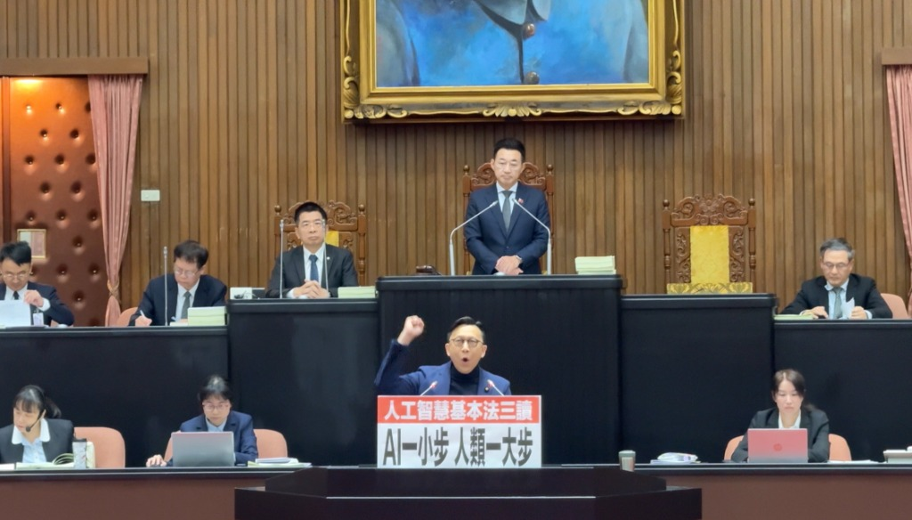

**Theme: From "Guardian Mountains" to "Smart Blue Skies", A New Century Declaration of Taiwan's Values**

**Time: 2 Minutes**

Chairperson, colleagues. AI is the most critical technology influencing the next century of humanity. Taiwan can confidently say: without our chips, without our engineers, there would be no AI present or future for the world!

However, since 2012 when Google recognized a cat's face and AI began to understand the world through ImageNet, the world has moved forward at speed. Yet, apart from chips, Taiwan has almost handed in a blank sheet in terms of legal frameworks. Once, we had the opportunity to be the first to legislate; instead, we became the last in Asia.

Fortunately, after today, everything will be different.

I want to thank President Han Kuo-yu again for his wise words, "The fragrance of the rose remains in the hand that gives it," which allowed the ruling and opposition parties to set aside their differences. I thank former Chairman Eric Chu and General Convener Fu Kun-chi for their strong support from the beginning. I also thank the party central, the caucus, all members of the Education and Culture and Transportation Committees, and the successive caucus whips Hong Mong-kai, Lin Szu-ming, Wang Hung-wei, Lo Chih-chiang, and Lin Pei-hsiang for their relay efforts. I also thank the DPP and TPP for their joint participation, and all the NGOs and scholars who never gave up. You have proven that Taiwan not only leads in semiconductor technology but can also contribute wisdom to leading legal frameworks!

Everyone, the competition in artificial intelligence appears to be a competition of computing power, backed by a competition of electric power; but fundamentally, it is actually a competition of values!

The Republic of China (Taiwan) possesses the most democratic and free values in the Chinese-speaking world. Starting tomorrow, combining our strongest chip technology, Taiwan will no longer just be a foundry; we will be the leaders and creators of AI legal systems! This act is our promise to the next generation. We want the future Taiwan to have not only the "Guardian Mountains" of our semiconductor industry, but also the blossoming of AI, lush green grass, and smart blue skies!

Today's third reading of the "AI Basic Act" is just the starting point for Taiwan to become an advanced country in AI legislation. In the future, we must continue to promote the formulation of relevant acting laws to solve the various dilemmas Taiwan currently faces. We have the most advanced chips and the best engineers, but we cannot let autonomous vehicles drive on Taiwan's roads; we have a complete satellite supply chain, but the public's mobile phones cannot directly connect to satellite communications; we want to innovate in AI blockchain, but we worry all day about accidentally breaking the law and going to jail.

We hope that this small step for AI today will be a giant leap for all people of Taiwan. In the future, we will gradually complete various legal frameworks in the AI technology field to create an environment friendly to the continuous evolution and development of AI technology for Taiwan. This is the mission and responsibility of a legislator. Today, the AI Basic Act draws lessons from other advanced countries in the world. In the future, we hope Taiwan can become a model for global AI legislation, letting countries around the world come to learn from Taiwan. Let us work together for the progress of Taiwan and the world, regardless of party affiliation, and hand in hand plan the next century of coexistence between humans and machines!

Thank you all.

---

**Read More:**

[Legislative Process of the AI Basic Act](https://juchunko.com/en/act/ai-basic-act/)
