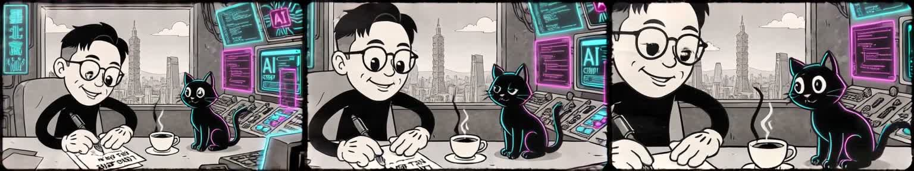

import demoVideo from "../../../assets/images/infinite-tv-rtx5090-ai-livestream/local-i2v-demo.mp4?url";

My first Windows + RTX 5090 port of [Infinite TV](https://github.com/alex-remade/infinite-tv) answered two questions: could it run, and could it run faster? Turning it into a stream that could survive for hours required a harder round of engineering: continuous clip boundaries, protection against autoregressive corruption, Twitch comments that actually appear to viewers on time, and proof that video generation is not silently using cloud compute.

The current result is **local video generation on a single RTX 5090 through ComfyUI + LTX 2.5 NVFP4**. Every clip after the first is Image-to-Video, and the Twitch output sustains 9 FPS. Visual and narrative continuity are now usable. There is still a small motion jump at some clip boundaries; that is the next quality problem to solve.

> **Important correction:** during development, we did test fal.ai's LTX 2.3 and H3 Max cloud video routes. The prompt/vision code also used to prefer fal's OpenRouter proxy whenever `FAL_KEY` was present. That phase incurred real fal.ai usage and should not have been described as fully local. This post now separates the cloud experiments from the final local architecture. The local launch scripts explicitly disable both fal prompt routing and fal video.

## What Infinite TV does

It is an endless generative loop:

1. read Twitch chat;
2. let an LLM choose the next action from the comment, current frame, and story history;
3. generate the next video clip;
4. burn the selected comment or prompt into stream-only frames;
5. send those frames to Twitch through FFmpeg and RTMP;
6. use the last frame that was actually streamed as the next Image-to-Video input.

Step six sounds trivial. It is where long-running video systems tend to decay.

## The journey had three distinct phases

### Phase 1: port the Linux project to Windows

The upstream RTMP path used Unix FIFOs for audio. Windows has no `mkfifo`, so we replaced it with Win32 Named Pipes and fixed model paths, UTF-8 console behavior, and cross-platform model preloading.

The first local LTX 2.3 baseline took roughly 248 seconds per segment. Fewer frames and denoising steps brought it to about 150 seconds. An earlier `torch.compile` experiment reached about 35 seconds.

That 35-second number needs context. A later PyTorch / triton-windows combination failed on the complete LTX 2.3 transformer because of Triton kernel-group cache files. It remains a historical experiment, not today's recommended Windows recipe. A synthetic module compiling successfully is not proof that a real 13B or 22B workload is production-ready.

### Phase 2: cloud worked, but it was not the destination

To get the show moving, we tested fal.ai LTX and H3 Max. They were fast and easy to chain, but billed by generated video duration. More subtly, the prompt generator saw `FAL_KEY` and preferred fal → OpenRouter, so fal charges could continue even after video moved back to the machine.

We corrected both layers:

- `USE_FAL_OPENROUTER=false`: prompt and vision use direct OpenAI `gpt-4o-mini` by default, or a local OpenAI-compatible endpoint;
- `ENABLE_FAL_VIDEO=false`: a `FAL_KEY` alone cannot call billable cloud video. The switch and a cloud model id must both be explicitly selected.

The presence of a credential should never equal permission to spend. That rule is now enforced in code and tests.

### Phase 3: ComfyUI + LTX 2.5 NVFP4 made the 5090 practical

The breakthrough was not another tweak to the original Python pipeline. ComfyUI now owns LTX 2.5 NVFP4 on the GPU. Infinite TV sends a local workflow over HTTP, reads the generated frames, and keeps Twitch, RTMP, story state, overlays, and recovery in its Python engine.

This split gives us several benefits:

- ComfyUI manages the GPU, model, and LTX nodes;
- Infinite TV does not load a second copy of a 22B model in its own environment;
- video data stays on `127.0.0.1` and the local filesystem;
- the workflow can change without rewriting the Twitch and RTMP stack.

## Measured performance

Test setup: RTX 5090 32 GB, Windows, LTX 2.5 distilled NVFP4, 512×288, 121 requested frames per clip.

| Metric | Measured result | Context |
|---|---:|---|
| Raw ComfyUI bridge clip | ~5.1–7.1 s | Depends on video-only vs. audio and output retrieval |
| Complete live cycle | **13.53 s average** | 29 recent start-to-start intervals, including LLM, generation, and queue backpressure |
| Stream payload per clip | 121 frames / 13.44 s | Dripped at 9 FPS |
| Twitch RTMP | **8.9–9.0 / 9 FPS** | Sustained production rate |
| One live snapshot | 90 clips, 10,948 frames | 0 dropped, 0 rejected, 9.4 s queue |
| Automated tests | **14 / 14 passing** | Seam, padding, border, recovery, queue, and overlay checks |

Denoising speed matters, but the honest livestream number is the full interval from one clip start to the next.

<video src={demoVideo} controls muted loop playsInline preload="metadata"></video>

<small>A local LTX 2.5 Image-to-Video development sample. This is not fal.ai output.</small>

## Continuous video takes more than “feed the last frame back in”

### 1. Every clip after the first is explicit I2V

Each clip starts from the last clean frame that the previous RTMP batch actually accepted. If the quality gate rejects a clip, or RTMP accepts fewer than all 121 frames, neither the visual handoff nor the story history advances.

It is a transaction: if viewers did not see it, it did not happen in the story.

### 2. A 121-frame request decoded 129 frames

Our ComfyUI graph produced 129 decoded frames for a 121-frame request. The final eight are temporal padding and can collapse visually. The old loop streamed frame 129 and then fed it into the next generation, amplifying small errors into posterized lines, white or black borders, and rainbow edges.

We now stream only frames 1–121. Frames 122–129 are discarded, and only frame 121 can become the next handoff.

### 3. First-frame conditioning is not pixel identity

VAE encode/decode can still modify the conditioned first frame. The first streamed frame of a new clip is therefore replaced with the committed previous tail. That removes the hard visual cut, but it does not carry velocity or motion blur across independent denoising runs.

This explains the remaining small motion jump. The pixels are exact; the motion state is not. The next experiments should be overlap-aware generation, optical-flow seam scoring, or motion-state conditioning rather than a cosmetic crossfade that could create ghosting.

## Long-chain white, rainbow, and black borders

Pixel-level checks showed that every handoff remained exactly 512×288. There was no extra one- or two-pixel border. The real cause was semantic: vignettes, windows, and monitor frames in the image were repeatedly treated as scene structure and enlarged by autoregressive feedback.

The current recovery sequence is:

1. suppress frame, vignette, letterbox, black/white bars, and rainbow edges in the negative prompt;
2. detect rectangular edge structure;
3. try 12%, 16%, then 20% progressive full-bleed crops;
4. preserve frame 1 exactly and push in only over later frames;
5. after two failed generations, emit a locally synthesized push-in recovery segment;
6. do not advance the story during recovery, so the next real clip keeps the same narrative intent.

This keeps the upstream Infinite TV principle—**the output must never run dry**—without blindly feeding poisoned frames into the next generation.

## Why a received Twitch comment was invisible

The listener and renderer were both working. The RTMP queue had grown to 1,922 frames, or 213.6 seconds. The comment was burned into the right future clip, but that clip sat behind more than three minutes of old video.

After the fix:

- queue backpressure targets 18 seconds;
- the live queue typically stays around 8–10 seconds;
- a selected comment remains visible for about 85% of its clip;
- Traditional Chinese text receives pixel-level overlay verification;
- overlays touch only stream copies, while the clean final frame continues the I2V chain.

A log saying “comment selected” is not proof that a viewer saw it. Interactive latency has to be measured on the viewer path.

## Reproducing the setup

The complete model paths, environment template, start commands, tests, and provider matrix are in the [dAAAb/infinite-tv README](https://github.com/dAAAb/infinite-tv). The short version is:

1. install a recent ComfyUI with the required LTXV nodes;
2. add the LTX 2.5 NVFP4 transformer, Gemma 4 text encoder, and video VAE;
3. configure `COMFY_SERVER=127.0.0.1:8188` and `COMFYUI_DIR` in `.env`;
4. keep `USE_FAL_OPENROUTER=false` and `ENABLE_FAL_VIDEO=false`;
5. start ComfyUI, the Infinite TV backend, and optionally the dashboard;
6. run `scripts/start-ltx25-stream.py --image ... --output-mode rtmp`;
7. run `pytest -q`, then monitor generation count, RTMP FPS, and queue seconds together.

API keys and the Twitch stream key live only in the gitignored `.env`. Model weights, logs, frames, videos, and virtual environments are excluded from Git as well.

## What I learned

- **Local generation is only the first milestone.** Long-running state, queues, and degradation control are the real livestream problem.
- **Visual continuity, motion continuity, and story continuity are separate.** The first and third are now usable; motion seams still deserve work.
- **Never let an API key choose a provider automatically.** Billable services require an explicit action.
- **Commit the frame viewers actually saw.** That one rule protects both the visual chain and the narrative.
- **A quality gate needs recovery, not just rejection.** Bounded recovery beats perfectionism in a live system.
- **The RTX 5090 really is formidable.** But turning compute into a product required closing every loop around it.

The code is available at [github.com/dAAAb/infinite-tv](https://github.com/dAAAb/infinite-tv). There is now a reproducible route to an interactive generative livestream on one high-end consumer GPU—local-first, observable, and unable to spend on cloud video by accident. 🦐
