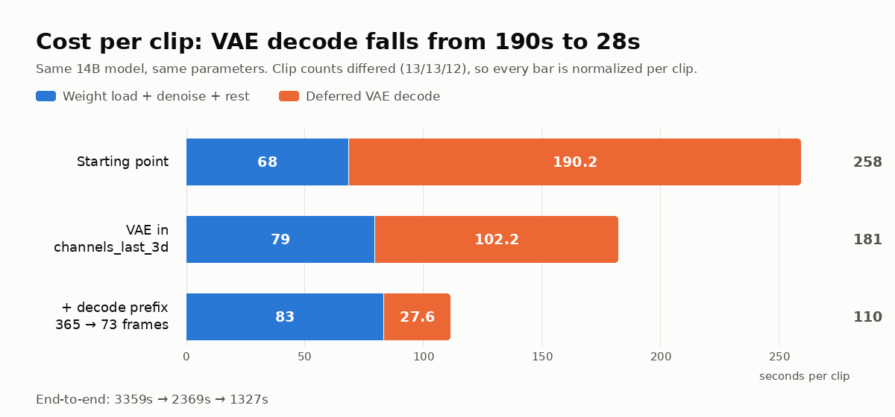

The DGX Spark in the office (NVIDIA GB10, 121GB unified memory) was sitting idle, so I gave it a job: port **LiveAvatar**, open-sourced by Alibaba's Quark team, onto it and generate a talking digital double of myself — from one photo and my own voice, entirely offline.

The result first. Every pixel in this clip was computed on that machine: the face comes from a still photo, the lip sync from locally synthesized speech, the body motion from a pose signal extracted out of another video. No cloud API anywhere:

<video
  src="/images/liveavatar-dgx-spark/fullframe-pose-cosyvoice.mp4"
  poster="/images/liveavatar-dgx-spark/fullframe-pose-cosyvoice-poster.jpg"
  controls
  playsInline
  style={{ maxWidth: '100%', borderRadius: '12px', margin: '1.5rem 0' }}
>
</video>

| | |
|---|---|
| Hardware | DGX Spark (GB10, sm_121, **aarch64**, 121GB unified memory) |
| Video model | Wan2.2-S2V-14B (14B params) + LiveAvatar LoRA, 47GB total |
| Speech model | CosyVoice2-0.5B, local zero-shot voice cloning |
| Precision | FP8 (`torch._scaled_mm`) |
| One render | 21s of video / 896×512 / 525 frames, **about 35 minutes** |
| Cost | $0 in API fees |

Upstream had never tuned any of this for this machine — so this post is a log of what you do when nobody has paved the road for you.

## First, what are these things?

### LiveAvatar: making a photo talk

Give it a portrait and an audio track, and the model generates video of that person speaking those words, frame by frame. The core is **Wan2.2-S2V-14B** (S2V = speech to video); LiveAvatar adds a LoRA on top that compresses a diffusion model normally needing 40+ denoising steps down to **four**, and restructures generation into streaming chunks — which is why it can keep generating indefinitely instead of topping out at a five-second clip.

It also accepts a second kind of conditioning: a **pose video**. You can take the body motion from one video and apply it to your target subject. That feature is the source of every interesting failure below.

### DGX Spark: a unified-memory desktop machine

Two characteristics matter here, and both bite:

**First, 121GB of unified memory.** CPU and GPU share one physical pool. Upside: a 14B model fits with room to spare. Downside: "offload weights to the CPU to save VRAM," a standard trick on discrete GPUs, is completely meaningless here — as I found out the hard way.

**Second, `aarch64`.** This is the real pain. On x86 Linux, `pip install` takes seconds because PyPI ships prebuilt wheels. On ARM, plenty of packages have no wheel at all, so you compile from source — and some of them take hours with no guarantee of success.

## Pitfall one: two uninstallable dependencies, neither of them necessary

Two packages in `requirements.txt` are hard blockers on aarch64. **When a dependency won't install, the first move isn't to force the build — it's to check whether you need it at all.**

### flash-attn: I thought it was the engine; it's the turbocharger

FlashAttention is a CUDA kernel that speeds up attention. No ARM wheel, and compiling for sm_121 from source is absurdly expensive. But reading the code revealed something: the `attention()` function in that file *already* falls back to PyTorch's built-in SDPA when flash-attn is missing — **the problem is its neighbor `flash_attention()`, which just `assert`s and dies**, and the model body, the motioner, and the sequence-parallel path all call that one directly.

So I wrote an `sdpa_varlen_fallback()` handling variable-length padding masks, causal masking (aligned to flash-attn's bottom-right semantics, not top-left), and GQA.

The important part is **verification, not "it runs"**: benchmarked against fp32 naive attention across six scenarios, every error landed inside bf16 precision (`< 0.008`). Better still, on the actual inference path `context_lens` is always `None` — meaning on this path the fallback is **exactly equivalent** to flash-attn, not an approximation.

### decord: a video reader, better off hand-written

decord reads video frames, and likewise has no ARM wheel — not even the community `eva-decord` fork. What it blocks is `--pose_video`: the entire motion-driven path.

Only three of its methods are actually used (average frame rate, length, fetch specific frames), so I wrote my own. **The backend choice was measured, not assumed** — I tried both candidates against the same 1920×1080 / 60fps video, pulling the first 1151 frames:

| backend | Color | Frame count | Reading 1151 frames |
|---|---|---|---|
| **imageio_ffmpeg** | Honors the container's BT.709 tag, **correct** | 27182 (**right**) | 2.8s |
| cv2 | Always BT.601, up to 20/255 off | 27204 (trusted a bad header) | 3.7s |

Both pitfalls were found by measuring, and both generalize:

1. **OpenCV ignores the video's color-space tag** and always applies the older BT.601 coefficients for YUV→RGB, giving every pixel a systematic bias. Forcing ffmpeg to BT.601 made the two bit-identical — confirming the difference is purely the color matrix, and the sampling logic was fine.
2. **The container's frame-count header is wrong**: it claims 27204; counting frames gives 27182. cv2 trusts the header and is wrong; imageio_ffmpeg estimates from duration × fps and is right.

Verification was again bit-level: five sampled frames matched raw ffmpeg RGB output exactly.

**The lesson: a requirements file is a snapshot of the author's environment, not a list of your necessities.** These two packages blocked the whole project, and they turned out to be one performance optimization and one thin utility layer.

## Pitfall two: the compiler is too old, and you can't turn it off

The nastiest trap on GB10. Its compute capability is `sm_121a`, but the `ptxas` compiler bundled with PyTorch 2.9.1's Triton is the CUDA 12.8 build, which **only knows up to `sm_120a`**. Hit it and you get:

```
triton.runtime.errors.PTXASError: Internal Triton PTX codegen error
```

The system's CUDA 13.0 ptxas does know `sm_121a`, so point Triton at it:

```bash
export TRITON_PTXAS_PATH=/usr/local/cuda/bin/ptxas
```

**The nasty part is that disabling compilation doesn't avoid this.** The project has an `ENABLE_COMPILE` switch, and intuitively turning it off should keep you away from Triton — but the FP8 quantization function `quant_fp8()` carries an **unconditional** `@torch.compile`, independent of that flag. So the moment you pass `--fp8`, you will hit it.

## Performance: three lessons in measuring before guessing

The first video came out on the morning of August 7, 2026. Once it ran at all, the following week had exactly one theme: **it was too slow.** Twenty-odd seconds of video took nearly an hour.

This is the part I most want to share — because I guessed the bottleneck wrong three times in a row, and each time a single measurement demolished the guess on the spot.

### Guess one: compilation will save me

`torch.compile` with `max-autotune` is the standard accelerator. And it worked: denoising went from 3.11 s/step to 2.18 s/step, **30% faster**.

End-to-end went from 882 seconds to **906 — slower**.

Because denoising was only 11% of wall clock. A 30% cut saved 29 seconds, and compilation overhead cost more than that. **Speeding up something that's 11% of the total has an 11% ceiling.**

### Guess two: on unified memory, offloading must be pure waste

Breaking down the run left 59% of the time unaccounted for. The prime suspect was `--offload_model True`, which shuttles weights between CPU and GPU to save VRAM. This machine has unified memory — **CPU and GPU are the same physical memory, so what exactly is being moved?**

Airtight reasoning. Measured result:

| | `offload=True` | `offload=False` |
|---|---|---|
| Cost per block | 60.2s | 59.5s |

**One percent apart — inside the noise.**

Why was the guess wrong? Because on unified memory `.cpu()` was never really moving data in the first place, so there were no copies to save. Attributing that 59% to offloading was **a guess I never measured**.

### The real culprit: the final VAE decode

After putting timers in every stage, the culprit appeared immediately:

| Stage | Time | Share |
|---|---|---|
| Load weights + merge LoRA | 257s | 8% |
| Denoise (52 blocks × 4 steps) | ~630s | 19% |
| **Final VAE decode** | **≥ 2280s** | **≥ 68%** |

The reason: this path defers the decoding of all 13 chunks to a single pass at the end. The VAE (which turns compressed latents back into pixels) is compute-heavy to begin with, and decoding 589 frames in one go is what that costs.

Two official flags looked like they'd fix it. Rather than burning an hour testing each, I **read the source** — both are dead ends: `--enable_vae_parallel` is force-set to `False` on the single-GPU path (it wants five or more GPUs), and `--enable_online_decode` is written so it only decodes chunk zero, with the rest still going through the deferred loop. **Total work unchanged.**

What actually worked was converting the VAE's 3D convolution weights to `channels_last_3d` memory layout: decode 34.4→18.3s, encode 12.2→6.4s, **47% off per chunk**. For the record, `cudnn.benchmark` tested in the same batch did **absolutely nothing** (0%).

End-to-end: 3359 seconds → **2369 (−29.5%)**. And numerical safety was verified rather than assumed: against an fp32 reference, max error was **identical** to before the change (3.591e-02).

### Guess three: I thought I knew how big the tensors were

After that fix, something strange: **the same code took 24.7 seconds per chunk in my isolated benchmark but 102 seconds in the real run. A 4× gap.**

I eliminated four hypotheses in order — memory pressure pushing cuDNN toward a bad algorithm (no; adding 40G of ballast changed nothing), the 14B model hogging resources (no; moving it away gave the same number), GPU thermal throttling (no; a steady 2450MHz, throttle flags clean), the project touching backend flags (no).

Finally I had the real run print its own tensor shapes. The answer: **the tensors I fed the benchmark were too small.** The real input decodes to **413 frames**, not the 121 I had derived from the config file. 413/121 = 3.4 — precisely the "4×".

And *why* it's 413 frames is the genuinely interesting part. The code first repeats the reference frame into 5 frames (to skip a causal-VAE boundary artifact), and **the next line takes that already-5-frame tensor and repeats it 73 more times**, producing 365 frames.

**The model never sees anywhere near that much.** The downstream motioner reads only the last 19 frames — and the code itself computes that 19 and passes it to the model as metadata. **The metadata says 19 while the tensor is 92. That inconsistency is the bug's fingerprint.**

So the VAE was decoding 73 frames of data that nobody reads, once per chunk. After trimming:

| Prefix length | Per chunk | Max error |
|---|---|---|
| 365 (as shipped) | 103.2s | — |
| **73** | **27.0s** | 2.54e-02 |
| 33 | 16.6s | 5.27e-02 |

The yardstick is bf16's own noise floor, **3.591e-02**. And 73 isn't an arbitrary pick — it's the exact value the code itself already assumes. Below 33 the error exceeds the noise floor, so no.



End-to-end fell from 2245 seconds to **1327 (−41%)**. Decoding dropped from 55% of the run to 25%, and **denoising finally became the largest slice.**

All three lessons are the same sentence: **measure before you guess.** The third is worth its own note — the first two were "attributing without measuring," but the third was **"the number I believed wasn't the real number."** A shape you derived yourself from a config file will go on being wrong very convincingly.

### Postscript: the "closed" conclusion reopened

While writing this post I re-ran the compile switch — because the reason I closed it was "denoising is only 11%," and after the optimizations **denoising is 58%**. The premise changed, so the conclusion deserved a re-test.

Same parameters, same 11 chunks, the compile switch as the only variable:

| | Off (baseline) | On |
|---|---|---|
| Denoise per step | 5.81 s/it | **4.18 s/it (−28%)** |
| Denoise + conditioning | 1194.9s | 1069.9s (−10.5%) |
| Deferred decode | 545.3s | 557.3s (+2.2%) |
| **End-to-end** | **2072s** | **1936s (−6.6%)** |

**The same switch is a net loss at 704×384 and a net win at 896×512.** The technique didn't change; its share of the total did — which makes "measure before you guess" more complete than I'd stated it: **a conclusion that was correct when you drew it expires when the things around it get optimized away.**

One cost to be explicit about, though: **this isn't the same video rendered faster — it's a different draw.** Compilation swaps the underlying kernels, floating-point accumulation order changes with them, and four-step diffusion generating chunk after chunk amplifies the difference. Comparing the same frame index, the divergence concentrates on the person (mean abs diff 12.2 across the face and hands) while the background barely moves (1.15) — identity and scene stay stable, but the hand position and head angle genuinely differ.

So the right way to use this switch: **leave it on while you're still exploring and take the 6.6%; once a particular take passes your review, reproducing it means keeping the same settings.**

## Motion driving: the model won't dodge the station logo

With the pose path working, the first result had background artifacts. And worse — **a second face materialized in the frame.**


<video
  src="/images/liveavatar-dgx-spark/second-face-artifact.mp4"
  controls
  muted
  loop
  playsInline
  style={{ maxWidth: '100%', borderRadius: '12px', margin: '1.5rem 0' }}
>
</video>

The cause made immediate sense once found: my motion source was a TV program with **burned-in graphics** — a station logo in the corner, a yellow lower-third caption bar. The preprocessing only does "proportional resize + center crop," so **the logo and caption bar were fed in verbatim as pose conditioning**, covering roughly a third of the frame. As for the second face: that's the person *in the driving video*, painted in as part of the scene.

The fix is to crop the driving video down to just the person. Quantified (sampling a background region where nobody is, compared frame by frame against the no-pose version):

| | Mean background diff | Worst frame |
|---|---|---|
| Original driving video | 6.89 | 18.61 |
| **After cropping** | **2.38** | **12.09** |

**Background contamination down 65%**, second face and ghosting gone.

Two rules for anyone doing this later:

1. **Crop the driving video to "person only, square, zero overlay graphics" beforehand.** Preprocessing will not dodge watermarks, captions, or logos for you — it resizes proportionally and cuts a square out of the middle.
2. **Match the driving video's framing to the target photo** (how large the person is and where they sit in frame). Too far apart and the pose signal's "shoulder / desk" lands on the target scene's "ring light / shelf" and leaves residue in the background.


Applying this to my own material, just getting "the head roughly the same size on both sides" took three iterations of side-by-side comparison — and I had the direction backwards at first.

## Voice: a failure that sounds completely fine

I ran three TTS backends (ElevenLabs, HeyGen, local CosyVoice2) through the same pipeline with the same photo and the same random seed. The conclusion is clean: **per-chunk decode cost was identical across all three** (27.6 / 27.5 / 27.6s), and end-to-end differences came purely from chunk count, which audio length determines. **So pick a speech backend on timbre alone — rendering cost doesn't enter into it.** Local CosyVoice2 needs no external API and isn't slower either (21 seconds of speech synthesized in 15).

But there's a **silent** failure mode here that I want to flag, because it nearly made it into the finished product.

**CosyVoice2 only accepts Simplified Chinese.** Same text, same reference voice, the only variable being the script:

| Input | Transcription match |
|---|---|
| Traditional | **0.567** |
| Simplified | **1.000** |

Fed Traditional characters, it mangles words into unrelated ones and occasionally into gibberish syllables. Its tokenizer was trained on Simplified text.

**The frightening part: the broken audio still sounds like normal speech, the lip sync still matches, and the video looks entirely fine.** Without a word-level transcription check you will never notice. The version I had already rendered into video on August 7 was broken (match 0.589) and I had no idea at the time. The fix is trivial — convert the input to Simplified first; the output speech is still Taiwanese-accented Mandarin.

The method for picking a reference voice is worth recording too: **measure both metrics, because measuring timbre alone selects a candidate whose speech is broken** (my first version did exactly that). Content accuracy via Whisper word-level transcription; timbre similarity via speaker-embedding comparison against a held-out recording no candidate used. The two effects separated cleanly — switching to audio from the same source video took similarity from 0.466 to 0.688; extending the reference to 25 seconds took it to 0.735. But **too long and the content collapses**: the candidate near the 30-second ceiling failed all three takes, leaking the prompt text into the output.

## Finally: where the resolution ceiling is

The original output was a 512×512 face close-up. Making an uncropped full-frame version — the whole studio in shot — ran into a hard limit.

The more you fit in frame, the fewer pixels the face gets, so going full-frame requires raising resolution at the same time, or the face is down to 47 pixels tall. And the resolution ceiling isn't model size, it's the **KV cache**:

| Output | KV cache | Measured peak memory |
|---|---|---|
| 704×384 | 38.7G | 58.5G |
| **896×512** | 65.6G | **88.3G** |
| 1088×640 | 99.6G | 125G (**doesn't fit**) |

(One fun find: the `for gpu_id in range(4)` in the code looks like it allocates for four GPUs. It actually allocates for **four denoising steps** — so a single-GPU setup can't cut it either.)

On a 121GB machine the ceiling is 896×512, which is why the finals are that size.

One more detail: "no cropping" actually produces black bars, because output dimensions get rounded to multiples of 64 and the aspect ratio therefore never lands exactly on 16:9. I wrote a small tool that solves backwards for the source crop that lands exactly — shaving 28 pixels of width (1.5% of the original) gives **zero black bars and zero cropping**.

The six final videos (three voices × with/without motion), with face, script, and resolution held constant:

| Voice | Audio only | + motion |
|---|---|---|
| HeyGen | 2291s | 2486s |
| ElevenLabs | 2210s | 2286s |
| **Local CosyVoice2** | **2072s** | **2156s** |

All six peaked at exactly 88.3G. Here's the audio-only version, to compare against the motion-driven one at the top:

<video
  src="/images/liveavatar-dgx-spark/fullframe-audio-only.mp4"
  poster="/images/liveavatar-dgx-spark/fullframe-audio-only-poster.jpg"
  controls
  playsInline
  style={{ maxWidth: '100%', borderRadius: '12px', margin: '1.5rem 0' }}
>
</video>

An unexpected result: **in the motion-driven clip at the top, the caption bar along the bottom stays sharp and readable across all 525 frames** — I sampled ten points through the clip and even the comma survives. The model redraws that text from latents on every single frame; it had no business holding up.

**The audio-only clip just above, however, does not hold up**: the same caption smears into mush around frame 60, and the punctuation wobbles through the middle. The only difference between the two is the pose conditioning — which appears to pin down the frame's geometry, and the burned-in graphics along with it. This is an n=1 observation, not a rule, but if you're generating frames with text in them it's worth pulling on.

And here's the very first clip from day one — the official sample face, 3.7 seconds, 704×384. A week separates it from the one above:

<video
  src="/images/liveavatar-dgx-spark/first-clip.mp4"
  controls
  muted
  loop
  playsInline
  style={{ maxWidth: '100%', borderRadius: '12px', margin: '1.5rem 0' }}
>
</video>

## The part that has to be said: the other side of this

I fed in my own face and my own voice and got back a double that talks and gestures. The whole thing ran on a desktop machine, fully offline, in about 35 minutes.

**Swap the photo for someone who isn't you, and this is a deepfake.**

There is no technical barrier left. No cloud service's content moderation can intervene, because nothing needs to connect to the internet. No API key can be revoked, because the weights are on your own disk. My strongest feeling coming out of this experiment wasn't "how impressive" — it was **"anyone can do this now."**

I still argue for open source, and the reason is this: **the capability already exists; the only variable is whether defenders can see it.** Running it yourself is how you learn where the tells are (the subtle background drift in generated video, say, or how sensitive voice cloning is to reference length), which is how you learn where detection tooling should aim, and what a legal conversation about digital identity verification should actually look like. The threat you can't see is the dangerous one.

Practically: **any video or audio of you in public is training material for your double.** The reference clip I used was 25 seconds long.

## Appendix: specs and the time bill

- Hardware: DGX Spark (GB10, sm_121, aarch64, 121GB unified memory)
- Environment: Python 3.11 + PyTorch 2.9.1+cu130, CUDA 13.0
- Models: Wan2.2-S2V-14B + LiveAvatar LoRA (47GB), CosyVoice2-0.5B
- Dependencies skipped: `flash-attn` (replaced with an SDPA fallback), `decord` (replaced with a hand-written ffmpeg reader), `deepspeed`/`sam2`/`insightface` (unused on the single-GPU path)
- Four upstream bugs fixed: a broken TTS import, the VAE not being moved back to GPU when `offload_model=False`, a hard-coded conditioning cache size, and those 73 prefix frames nobody reads
- Performance: end-to-end 3359s → **1327s** at equivalent chunk counts
- This machine normally hosts a local LLM that eats 87 of its 121GB — it has to be stopped before any of this runs

As I always say: the democratization of technology begins with the willingness to do it yourself. The other dividend of doing it yourself is learning what to worry about, and what not to.

---

## A Note on Using Open-Source Projects from China

All three components here — LiveAvatar (Alibaba's Quark team), Wan2.2-S2V (Alibaba's Wan team), and CosyVoice2 (Alibaba's FunAudioLLM team) — **come from companies in mainland China**. A few reminders in my capacity as a legislator.

My position is consistent: **open weights and open source know no borders**, good technology deserves to be studied and used, and this post is a demonstration of exactly that. But this case differs from the local language models I've written about before in one important way, and it's worth spelling out:

**First, this isn't just downloading weights — it's executing someone else's code.** Model weights are *data*, read by an engine you trust. A full project like this is **executable Python**, running with full filesystem and network access. That's a categorically different level of supply-chain risk. In practice: get it from the official GitHub and official Hugging Face repositories (this post used `Alibaba-Quark/LiveAvatar`, `Wan-AI/Wan2.2-S2V-14B`, `Quark-Vision/Live-Avatar`, and `FunAudioLLM/CosyVoice2-0.5B`), never from forwarded links or unofficial mirrors, and run it in an isolated environment. Worth noting: all of these carry the genuinely permissive **Apache 2.0** license — considerably cleaner than the "community licenses" on the two models I wrote about last time.

**Second, the risk with these models isn't censorship — it's misuse.** A language model's political bias shows up as refusals or official-line answers. Image and speech generators don't refuse; they faithfully execute whatever conditioning you hand them. The risk isn't that the model holds a position — it's **the capability itself**: thirty seconds of public video is enough to clone a person's face and voice. That is a global problem, and it has nothing to do with the developers' nationality.

**Third, open source delivers something very concrete here: it runs offline and it can be audited.** Not one bit of this output ever left the office — not the photo, not the voice, not the finished video. For a parliamentary office handling constituent petitions and bill research, that is not a small thing. And because the source was in our hands, we could discover things like "that flag only decodes the first chunk" and "that tensor is four times larger than the model needs," and then fix them. **A closed service would have handed you a slower result and no reason to look.**

One honest footnote: Apache 2.0 governs what you may do with the code and weights. It says nothing about what you generate with them. A software license has never been a substitute for content governance — that part is the job of those of us who write the laws.
