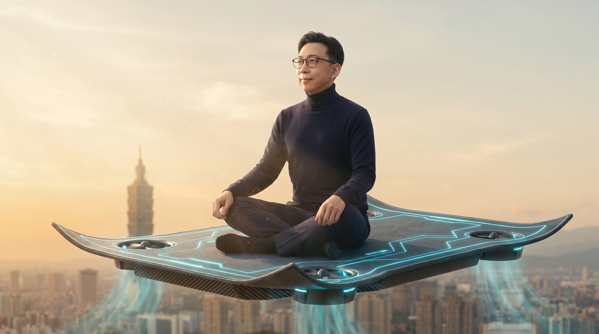
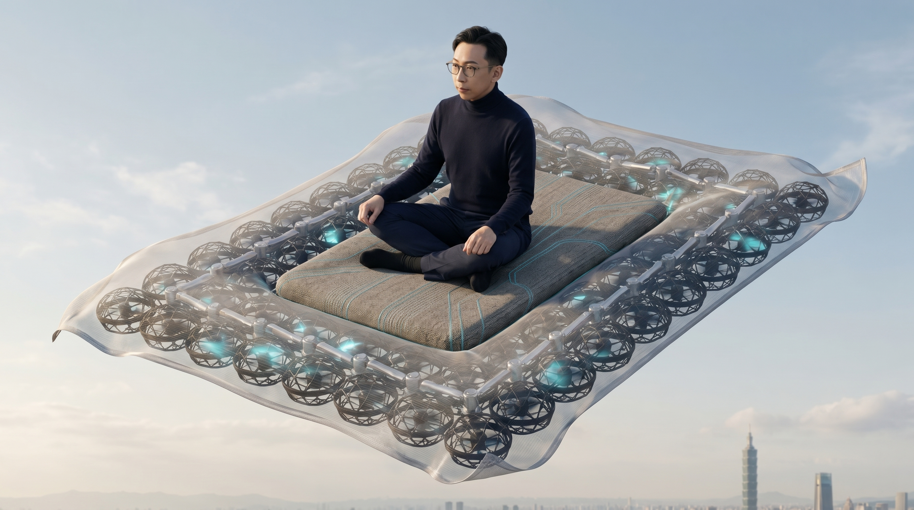
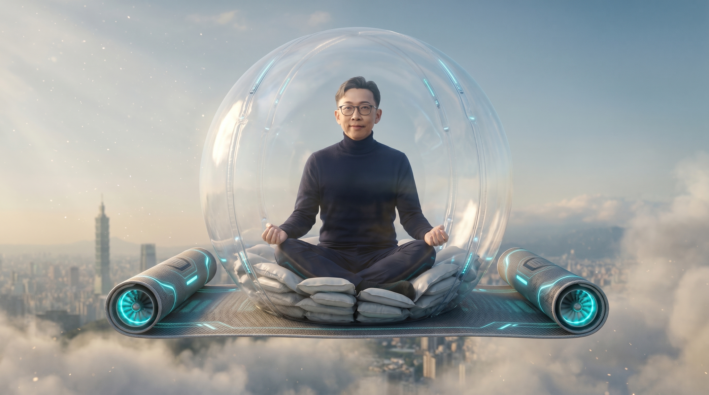

# 不是竹蜻蜓，是飛毯

> **問題：**「如果上百上千上萬個無人機馬達夠小、夠力，原則上要做到怎樣程度，才能像小叮噹的竹蜻蜓一樣，把人或物飛起來？」

這是某個朋友在 2026 年 5 月深夜兩點問我的問題。

我本來要簡單回他「不可能啦」，但坐下來真的算了一下——
然後發現這個問題的答案，**意外地把整個機器人產業的下一個 50 年攤開來給我看**。

---

## 🧮 先講殘酷的物理：竹蜻蜓為什麼不可能

懸停所需功率有一個很簡單的公式（**Disc Loading / Momentum Theory**）：

$$ P = \frac{T^{3/2}}{\sqrt{2 \cdot \rho \cdot A}} $$

- **T** = 推力（牛頓）
- **ρ** = 空氣密度 ≈ 1.225 kg/m³
- **A** = **總旋翼盤面積**

讓我們飛起一個 70 公斤的人（686 N 推力），看看不同盤面積要多少功率：

| 盤面積 | 懸停功率 | 對照 |
|---|---|---|
| 0.05 m²（**竹蜻蜓尺寸**）| **70 kW** | 一台保時捷 911 滿輸出 |
| 0.5 m²（背包式 EVTOL）| 22 kW | 一台機車 |
| 2 m²（飛行外骨骼）| 11 kW | 還是很大 |
| 10 m²（直升機）| 5 kW | 接近實際 |
| 100 m²（超大旋翼）| **1.6 kW** | 吹風機等級 |

**規律很清楚——A 越小，功率暴增。**

竹蜻蜓尺寸要 70 kW 持續輸出，這還只是「**能飛**」。
你還要：

- 一顆能放出 35 kWh 的電池（**重量比你還重 3 倍**）
- 一陣時速 270 公里的下洗氣流（**站在你旁邊的人會被吹飛**）
- 一個沒有任何旋翼意外的萬無一失（**你不希望你的頭被切掉**）

換句話說：**單純把無人機馬達做小做多，物理上回不去竹蜻蜓**。

---

## 💡 但我發現一件事：「**致動器**」可能根本被分錯類了

我那篇上一篇文章（[機器人手肘 vs 無人機馬達](/blog/zh/harmonic-drive-actuator-101)）提到，
無刷馬達是無人機跟機器人關節的「**共同核心**」。

但寫完之後，我重新想——
這個分類其實有個盲點。

朋友提醒我：**這兩件事完全不同。**

> 「Actuator 比較像是『物體**內**致動』——例如肌肉、機器人關節。」
> 「Ion thruster 那條無馬達技術路線，可能更適合『物體**外**致動』。」
> 「到那時候，就真的是**哈利波特的飛行魔法**，而不是竹蜻蜓了。」

這句話讓我整個愣住——這是個漂亮的工程分類，我以前**從沒聽過**。

讓我把它攤開：

---

## 🔬 兩種致動：身體裡 vs 身體外

### 🦾 路線 A：**物體內致動（In-Body Actuation）**

這條路線解決的問題是：**讓物體本身會動**。
例子：
- 人類的**肌肉**（10¹⁹ 個分子馬達在你身體裡）
- 機器人的**關節**（每個關節 1 顆無刷馬達 + 1 顆諧波減速器）
- 章魚機器人的**軟肌肉**（介電彈性體 DEA）
- 微創手術機器人的**末端執行器**
- 義肢、外骨骼

物理本質：**直接接觸 + 結構驅動**。
你**靠機械接觸把力傳給世界**。

這條路目前已經有產業——但壟斷者不是台灣。

### 🌪️ 路線 B：**物體外致動（Out-of-Body Actuation）**

這條路線解決的問題是：**讓物體在空間中位置改變，但不靠機械接觸**。
例子：
- **離子推進（Ion Thruster）**：電場直接離子化空氣推動
- **電磁懸浮（Maglev）**：磁場推送
- **聲波懸浮**：超音波壓力場
- **電動流體動力學（EHD）**：MIT 2018 的無馬達飛機
- **理論上的「場效應推進」**：完全無接觸驅動

物理本質：**透過場（field）作用於物體**。
你**透過場與環境互動，世界自己幫你出力**。

這條路目前**還沒有產業**——但**也還沒有壟斷者**。

---

## 🥷 路線 A 的現況：壟斷者是誰？

寫到這裡，我必須老實承認三件事——我之前那篇文章漏了它們。

### 🇯🇵 日本 Harmonic Drive Systems（HDS）—— 諧波減速器全球 60–70% 市佔
- 1970 創辦
- 全球四大工業機器人家族（ABB、KUKA、FANUC、Yaskawa）的長期供應商
- 市值約 50 億美元
- 護城河：50 年的客戶認證、精密加工 know-how

### 🇰🇷 韓國 ROBOTIS —— 機器人**教育與研究**市場霸主
- 1999 創辦
- 旗艦產品 **DYNAMIXEL** 智慧伺服
- 「Robot is ...」這個名字本身就是品牌哲學
- 客戶：**MIT、CMU、KAIST、東大、史丹佛、波士頓動力部分平台、ToddlerBot**
- 韓國今年人形機器人供應鏈整體**新增了 680 億美元市值**（KED Global, 2026/05）
- 它不只是賣零件，是賣「**整套機器人 OS**」

### 🇨🇳 中國深圳達妙（Damiao）—— 開源 / 學術 / 新創界的事實標準
- 2019 創辦（**大疆前工程師**創業）
- 旗艦 DM-J 系列關節電機（**MIT Mini Cheetah 同款**技術線）
- 性價比殺手：DM-J4310 約 USD 110，**同級 Maxon / HDS 要 USD 500–2000**
- 客戶：**OpenArm 開源機械臂直接打包達妙電機賣**；PiperX、Seeed Studio Wiki 都有
- 它是「**機器人世界的 Arduino**」——今天的學生用達妙做畢業專題，**5 年後創業還是用達妙**

### 🇹🇼 台灣的位置在哪？

我必須誠實——我們在「**精密齒輪 → 諧波減速器**」這條路線上**剛起步**。
我們有幾家精密齒輪廠送樣諧波減速器，
有幾家做電動工具齒輪的廠開始切人形機器人客戶，
有幾家伺服馬達廠在做無人機客戶順道做機器人客戶。

**但我們完全沒有 ROBOTIS 那種「教育 / 學術 / 開源生態」型的玩家**。
**也完全沒有達妙那種「高性價比 + 國際開源代理通路」的玩家**。
**也還沒成為 HDS 級的卡脖子零件供應商**。

我們在這條路線**有底氣，但沒有招牌**。

---

## ✨ 路線 B 的現況：誰都還沒贏

這條路線比較有趣，因為**全世界都還在實驗室裡**。

### MIT 2018：第一台無馬達飛機
- 用 **電動流體動力學（EHD / Ion Wind）** 推進
- 沒有任何旋轉零件
- 重量 2.45 公斤
- 飛了 60 公尺
- 推重比：**很爛**

但這是個 proof-of-concept——**它證明了「無機械接觸推進」物理上可行**。
從這天開始，「**真正的飛行魔法**」進入了倒數。

### 其他正在突破的方向
- **離子風推進的微縮版**：MIT 學生團隊試圖把它做進無人機
- **磁懸浮的人體應用**：日本研究讓老鼠懸浮，但用 17 特斯拉的超導磁場
- **聲波懸浮抓取**：可以懸浮小水珠、小零件
- **「人工反重力」**：完全理論，**目前無實驗證據**

### 距離「**像哈利波特那樣飛**」還有多遠？
**真心話：50–80 年。**

但寶博，**這個 50–80 年的時間軸，剛好跟台積電 1976 → 2026 的 50 年是同一個量級**。

---

## 🪄 但你有沒有發現——所有「人類飛行」幻想，都不是竹蜻蜓？

我一邊算一邊發現件事：
人類幾千年來想像「飛起來」，幾乎**從來不選竹蜻蜓**。

| 文化 | 飛行幻想 | 物理本質 |
|---|---|---|
| 古希臘（公元前 8 世紀）| **伊卡洛斯的翼** | 機械翼 |
| 阿拉伯民間故事（1100）| **飛毯** | 平面翼 + 場效應 |
| 達文西手稿（1488）| **撲翼飛行器** | 機械翼 |
| 中世紀歐洲女巫 | **掃把** |（純粹文化原型）|
| 超人（1938）| **披風** | 滑翔 + 場效應 |
| 蜘蛛人 | **絲線擺盪** | 機械 |
| 哈利波特（1997）| **披風 + 掃把** | 場效應 |
| 鋼鐵人（2008）| **裝甲推進** | 推進器 |
| 雷神索爾 | **披風 + 鎚索** | 場效應 |
| **哆啦 A 夢（1969）** | **竹蜻蜓** |（1960s 直升機直覺）|

**只有一個例外，就是哆啦 A 夢的竹蜻蜓。**

藤子·F·不二雄不是工程師，
他選竹蜻蜓，是因為**「好畫 + 好笑」**——不是因為物理合理。
哆啦 A 夢 1969 年連載，那是全世界迷直升機的年代。
他直覺地把「直升機」縮到頭頂——這是一個 1960 年代的設計直覺。

但我們不應該被它綁架。

---

## 🧮 拿出計算機——物理告訴你哪個才是對的

讓我用同一個懸停公式 $P = T^{3/2} / \sqrt{2\rho A}$，算不同形態起飛 70 公斤人：

| 形態 | 表面積 | 懸停功率 | 物理可行性 |
|---|---|---|---|
| 🧹 掃把 | ~0.03 m² | **90 kW**（保時捷 + 機車）| ❌❌❌ |
| 🪄 竹蜻蜓 | 0.05 m² | 70 kW | ❌❌ |
| 🦇 披風（兩翼展開）| 3 m² | 8 kW | ✅✅ |
| 🪅 **飛毯**（人坐臥姿態）| **2–4 m²** | **8 kW 懸停 / 1 kW 滑翔** | ✅✅✅ |
| 📂 翼裝 | 4–5 m² | 5 kW | ✅✅✅✅ |

**掃把是不可能中的不可能**——細長棍幾乎沒盤面積，騎乘姿勢還會破壞氣動。
JK 羅琳選掃把，是因為英國女巫文化原型——跟物理沒關係。

**飛毯反而是這個表裡物理最合理的之一**——
- 平整水平形狀 → **最佳氣動翼形**
- 面積足 → 推進效率高
- 乘員坐臥 → 重心穩、阻力小
- 可變形 → actuator 動態調整翼形
- 可載多人 → **生活化規模**

963 年前的阿拉伯人寫《阿拉丁》時選的是飛毯。
**我們現在才明白他們是對的。**

---

## 🏆 「人類飛行幻想」物理排行榜

最終成績單：

| 排名 | 形態 | 物理合理性 | 文化代表 | 真實可實現時程 |
|---|---|---|---|---|
| 🥇 #1 | **翼裝 / 機械翼** | ⭐⭐⭐⭐⭐ | 達文西、伊卡洛斯 | 2030-2050 |
| 🥈 #2 | **飛毯** | ⭐⭐⭐⭐⭐ | 阿拉丁（1100）| **2030-2040（本文重點）**|
| 🥉 #3 | **披風** | ⭐⭐⭐⭐ | 超人、蝙蝠俠、哈利波特、雷神 | 2070-2090 |
| 4 | 背包式 eVTOL | ⭐⭐⭐ | 鋼鐵人 | 2030-2050 |
| 5 | 獨輪 / 滑板 | ⭐⭐ | 回到未來、蜘蛛人 | 2040-2060 |
| 6 | 竹蜻蜓 | ⭐ | 哆啦 A 夢 | 不會發生 |
| 7 | 掃把 | ⭐ | 哈利波特、女巫 | 不會發生 |

**1100 年的阿拉伯人對物理的直覺，不輸任何人。**

那話說完了——
**這篇文章本來寫的是竹蜻蜓，現在變成「飛毯論」了**。
那我們來繼續問：能不能「**10 年內**」做出來？

---

## 🪅 飛毯 Mark 1：10 年內可推出的真實規格

一個明顯的事實：上面那些「50–80 年才能達到」的期望，是因為我假設你要「純離子推進」。
**但如果你肯讓他「混合物理」——那故事完全不同。**

讓我設計一個 2036 年上市的「飛毯 Mark 1」，完全不用「獲諾貝爾獎」級的突破。

### 三明治架構

```
🪅 飛毯 Mark 1：90 × 200 cm，重 25 kg，載重 80 kg

┌─────────────────────────────────────────┐
│ 上層：智慧布料 + actuator 變形邊緣   │ 動態調整氣動翼形
├─────────────────────────────────────────┤
│ 中層：8–16 個微型涵道風扇       │ 主推力來源（成熟技術）
│ 分佈在毯子四角 + 邊緣       │
├─────────────────────────────────────────┤
│ 下層：碳纖維蜂巢 + 電池 + 飛控         │ 結構與電源
└─────────────────────────────────────────┘
         🌬️  下洗氣流（柔和、可控）
```


*飛毯 Mark 1 設計示意：90×200 cm 平面智慧布料、邊緣 actuator 變形、四角四邊藏有微型涵道風扇。*

### 三個關鍵零件選擇都不需要「突破」

#### 🌬️ 涵道風扇 (EDF) 不是無人機螺旋槳

為什麼不用無人機螺旋槳？
- 螺旋槳**裸露 → 危險**（4 顆刀片轉在你旁邊）
- 螺旋槳**噪音大**（80 dB+）
- 螺旋槳**氣流亂**（會吹翻人）

**涵道風扇（EDF）**現在已經很成熟：
- 全包覆 → 安全
- 比螺旋槳**安靜 30–40%**
- 推力效率比同直徑螺旋槳**高 20%**
- **eVTOL 業界已經用了**（Joby Aviation、Lilium 都是）

放在飛毯的 **8–16 個位置**，每個直徑 8–12 cm，**完全藏在毯子的「蜂巢結構」裡**——
從外面看你只看到一張毯子。


*飛毯 Mark 1 內部結構示意：中央 80×120 cm 坐墊（軟質智慧布料），四周排列 30–40 個 HOVERAir 風格的網格籠涵道風扇（每顆 7–8 cm），透過致動器連接控制傾角；外層繃緊半透明技術布料，保留「飛毯」的視覺與柔軟度，同時所有旋翼都有全包覆網格保護。*

**成熟度**：✅ 2026 年現貨可買（HOVERAir X1 Pro 等級的網格無人機已商用）

#### 🦴 碳纖維蜂巢 + Actuator 變形邊緣

毯子要**輕、要剛、又要會變形**：

- **核心結構**：碳纖維蜂巢板（航太用，重量 1.5 kg/m²）
- **邊緣 actuator**：用形狀記憶合金 (SMA) 或介電彈性體 (DEA)
  - 起飛時：邊緣往下垂 → 增加升力（像鳥的翅膀末端）
  - 巡航時：邊緣展平 → 減少阻力
  - 緊急時：邊緣往上翹 → 緊急減速
- **表面布料**：智慧紡織（已商用）

**成熟度**：✅ 全部現成，需要的是「**整合**」而非「**發明**」

#### 🔋 電池：「毯內藏電池」而非「人帶電池」

這是唯一的瓶頸——但也可以解：
- 2026 Tesla 4680 電池：0.3 kWh/kg
- 2026 寧德麒麟電池：0.5 kWh/kg（2028 量產）
- 飛毯需要：約 0.4 kWh/kg

**Trick**：放棄「**人帶電池**」，改成「**毯內藏電池**」
- 25 kg 飛毯裡 → 12 kg 電池 → **6 kWh**
- 巡航功率 6 kW → **飛 1 小時**
- 懸停功率 16 kW → **可懸停 22 分鐘**

**成熟度**：⚠️ 邊緣可行——電池要等 2028-2030 量產級突破

---

## 🛡️ 「但也許會墜落」——透明泡泡不是魔法，是工程

飛毯不能只有「一層毯」，必須加上人體外部安全裝置：

- 乘員被**透明泡泡防護球**包覆（像泡泡足球）
- 下半身藏「**腹部安全氣囊**」，墜落時充氣
- 背面藏「**被動式降落傘**」，以防主動式高度控制失靈
- AI 飛控自動避障、在電量不足時自動對接「免費降落」


*飛毯 Mark 1 + 「透明泡泡防護罩 + 下半身氣囊」設計：墜落時乘員被完全保護，**安全性 = 心理閾值**。*

這個「透明泡泡」本身不是別出心裁——它借用了三項已成熟的技術：泡泡足球（運動安全已驗證）、3M Thinsulate（保暖兼緩衝）、汽車安全氣囊（可在毫秒內展開）。

這個「全身包覆設計」不是工程上的偏執，是「乘員心理閾值」最重要的佈局。
**2036 年的消費者，能不能接受個人飛行載具，是「心理感受」比「物理參數」更關鍵。**

---

## ⚖️ 飛毯 Mark 1 真實規格表

| 項目 | 數值 | 對標 |
|---|---|---|
| 尺寸 | 90 × 200 cm | 一張瑜伽墊 |
| 重量 | 25 kg | 一輛電動腳踏車 |
| 載重 | 80 kg | 一個成年人 + 小背包 |
| 巡航速度 | 60 km/h | 機車一般速度 |
| 巡航功率 | 6 kW | 小機車 |
| 懸停功率 | 16 kW | 大機車 |
| 飛行時間 | 巡航 60 分 / 懸停 22 分 | 計程車一程 |
| 飛行高度 | 100–500 m | 低空 |
| 噪音 | 65 dB | 一般對話 |
| 售價（首批）| NTD 200 萬 | 一台保時捷 Macan |
| 售價（量產 5 年後）| NTD 30 萬 | 一台中階機車 |

---

## 🇹🇼 台灣已經有「飛毯零件供應鏈」的 90%

這才是這篇文章真正的政策亮點——台灣現有的技術，**幾乎可以覆蓋每一層零件**。

| 層級 | 國際領導 | 台灣可切入點 |
|---|---|---|
| 涵道風扇 | Joby、Lilium、大疆 | 多家精密馬達廠與鴻海供應鏈 |
| 碳纖維蜂巢 | Toray（日）、Hexcel（美）| 台塑、復盛、台聯 |
| Actuator 邊緣 | Festo（德） | 上銀、和大 + 多家精密件廠 |
| 智慧布料 | Adidas、Hexoskin | 紡織業 + 工研院 |
| 電池模組 | 寧德、Tesla、Panasonic | 台塑、立凱-KY、AES-KY |
| 飛控 AI | NVIDIA、大疆 | 台達電、研華、聯發科 |
| 碳纖維結構 | Toray | 上緯、達紡 |
| **整機品牌** | — | **🚨 完全空缺** |

**台灣的問題不是「做不出零件」，是「沒有整機品牌」。**

這跟 1976 年台積電成立前的台灣一樣。
那年台灣能做「一個電子產品裡的幾乎所有組件」，但就是「沒有一個手上品牌」。
台積電出現，台灣改變了「商業模式」——不做品牌、但做「所有品牌都要的後面」。

50 年後，台灣可能需要另一個「台積電時刻」——
**不一定是台灣品牌的飛毯，
但是「世界所有飛毯都要用台灣零件 + 台灣設計」。**

## 🇹🇼 三條時間軸並行：10 年 / 30 年 / 50 年

寫到這裡，我必須修正我自己——這篇文章本來打算說「Path A 或 Path B 選一個」。
但飛毯出現之後，**台灣其實有三條時間軸可以同時走**：

### ⏱️ 10 年內（**飛毯 Mark 1**）：混合物理整機品牌
- **完全不需要諾貝爾級突破**
- 整合涵道風扇 + 智慧布料 + actuator + 碳纖維蜂巢
- 台灣已有 90% 零件供應鏈
- 缺的是「**整機品牌 + 跨部會法規 + 沙盒測試場域**」
- **這是 10 年內可看到的政策成果**

### ⏱️ 30 年內（**Path A：物體內致動供應鏈**）：諧波減速器 + 智慧 actuator 自主
- 對標 HDS（諧波）、ROBOTIS（教育）、達妙（開源）
- 台灣已有底子（精密齒輪、伺服馬達、半導體跨界）
- 缺的是「**送樣 → 量產**的中間 10–20 年跑道**」
- **這是 30 年內可看到的產業成果**

### ⏱️ 50 年內（**Path B：物體外致動先驅**）：離子推進、場效應、生物機械混合
- 全球都還在實驗室
- 台灣沒優勢、也沒劣勢——**startup line 是平的**
- 缺的是「**長期前瞻研究基金 + 國際合作網絡**」
- **這是下一代台灣人的 moonshot**

**三條路不是『選一個』，是『同時進行』**——
路徑 C 的飛毯短期內提供現金流 + 品牌勢能，路徑 A 加深零件專業度，路徑 B 作為長期霰彈。

## 🎯 五個具體政策提案

如果我們同時走兩條路，政府能做什麼？

### 提案 1：**「物體內致動」國家旗艦計畫**
- 仿造當年「**矽導計畫**」推動半導體那樣，
- 設立「**機器人致動器國家旗艦計畫**」，
- 5 年砸 300 億 NTD 補助諧波減速器、伺服馬達、力矩感測自主化。

### 提案 2：**設立「ROBOTIS 級」的台灣機器人開源平台**
- ROBOTIS 不是賣零件，是賣「**整套生態**」——硬體 + SDK + 教材 + 客服 + 認證
- 台灣應該推一個官方支持的「**台灣機器人開源平台**」
- 從**高中生 + 大學生 + 開源社群**開始滲透
- 目標：**10 年後全世界 maker 都認得「Made in Taiwan」的關節電機**

### 提案 3：**「物體外致動」前瞻研究基金**
- 國科會專案，鼓勵離子推進、磁懸浮、EHD 等**早期物理**研究
- 預算不需要大（每年 5–10 億 NTD），
- 但要**長期**——至少 30 年。
- 目標：**讓台灣有一兩個實驗室成為這條路的全球前 10 名**

### 提案 4：**修《政府採購法》允許機器人示範採購**
- 醫院、消防、長照、農業、教育——**都該採購本土機器人**
- 不要再以「最便宜 / 最大牌 / 進口品」為唯一條件
- 德國、日本、中國、韓國都有政府示範採購計畫，**台灣該有**

### 提案 5：**設立「機器人國家測試場域」**
- 韓國有，中國有，日本有，**台灣沒有**
- 找一塊地（離島、舊機場、工業園區皆可）
- 開放給國內外機器人新創**自由測試**
- 配套：**機器人保險、認證、責任歸屬法規**

---

## ⚠️ 一定要說的警示

寶博，這篇文章談的是 **30–80 年**的事情。

**這不是「明天的股市」，也不是「5 年內該買什麼」的指引。**
這是一篇**關於下一代台灣人的事業**的政策論述。

科幻**從來不是無中生有**——
1865 年 Jules Verne 寫了《從地球到月球》，1969 年人類登月。
1968 年 Arthur C. Clarke 寫了《2001 太空漫遊》裡的平板電腦，2010 年 iPad 上市。
2010 年 Iron Man 第一集裡 J.A.R.V.I.S. 助理，2024 年我們有 ChatGPT。

**科幻是 50 年後的工程規格書。**

但同樣的——**沒有人能保證寫進科幻的東西真的會兌現**。
反重力到現在還沒有實驗證據；
時間旅行違反熱力學第二定律；
心靈感應違反訊息因果律。

**所以這篇文章該被讀成「**思想實驗**」，不是「**投資指南**」。**

不過我相信一件事——

> **如果一個國家不思考 50 年後的物理，就只能去拿 50 年前別人做剩的訂單。**

這 30 年來台積電從一個無人問津的台灣公司變成全球神山，
證明了**這座島嶼很會做別人寫好的規格書**。

下一個 50 年，
我們敢不敢試試**自己寫規格書**？

---

> 想像力跟資金一樣，
> **集中投資**才有複利。
> **分散投資**才有平衡。
>
> 台灣現在最缺的，**不是技術**，是**敢分一點資金到 50 年後的勇氣**。

— 葛如鈞（寶博士） / 立法委員

---

## 📌 免責與說明

本文為**科技政策與遠期產業推演**，**並非任何投資建議或財務分析**。

文中涉及的「物體外致動」、「離子推進」、「飛行魔法」等概念，**皆屬實驗室階段或理論物理階段**，距離商業化可能有 30–80 年。讀者請勿將任何具體公司或技術視為投資標的。

文中提及之公司（包括日本 Harmonic Drive Systems、韓國 ROBOTIS、中國深圳達妙等）僅為產業現狀之客觀描述，**不代表任何投資推薦或負面評價**。

讀者若想深入了解產業細節，**請自行研究、自負風險、諮詢合格理財顧問**。本文觀點為個人意見，不代表立法院或所屬政黨立場。

