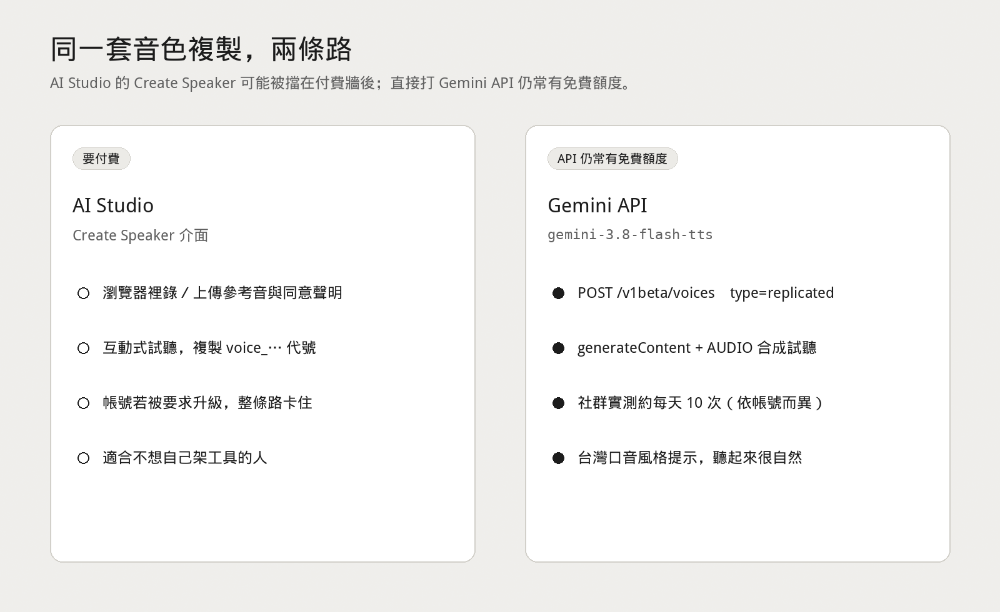
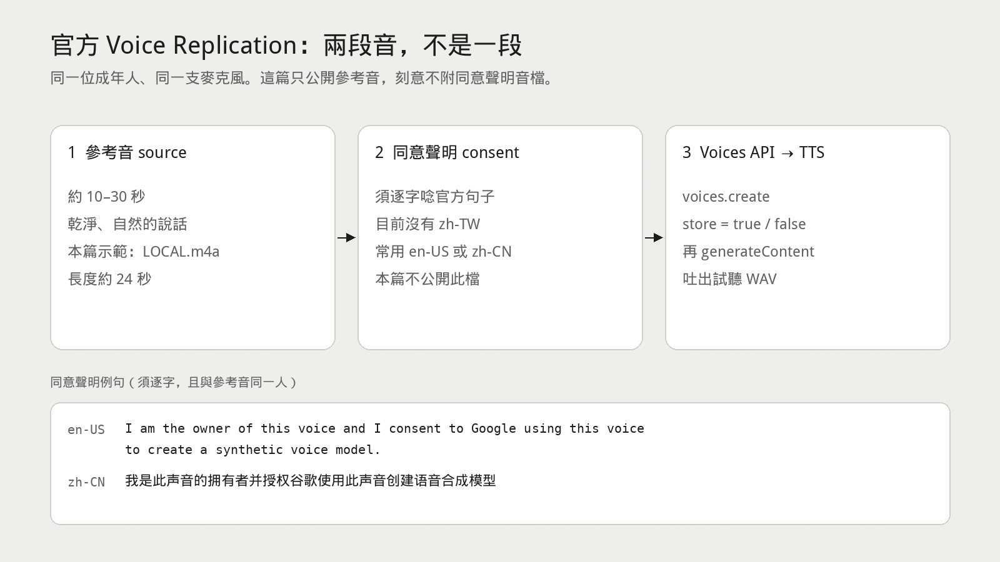
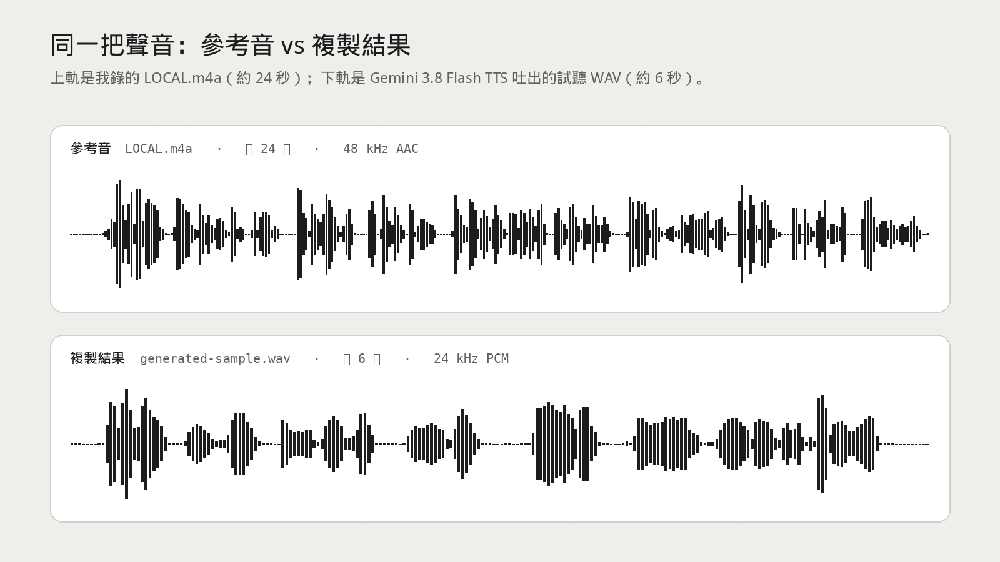

AI Studio 裡的 <strong>Create Speaker</strong> 要付費才開得了。我盯著那面牆看了一下，然後改走另一條路：直接調 <strong>Gemini 3.8 Flash TTS</strong> 的 API。

同一套官方 Voice Replication，瀏覽器介面被擋，API 卻還留著免費額度——社群實測大約<strong>每天 10 次</strong>（以帳號實際 rate limit 為準）。更意外的是，加上台灣國語的風格提示之後，口音比我預期的自然。



所以這篇不是「再買一個 TTS 訂閱」，而是：官方文件怎麼走、我把流程包成什麼工具、以及一段我自己的聲音對照。

## 開源工具：本機 Create Speaker

我把官方流程收成一個本機網頁工具：

[github.com/dAAAb/gemini-3.8-flash-tts-voice-clone](https://github.com/dAAAb/gemini-3.8-flash-tts-voice-clone)

它做的事很單純——你自己貼 [Google AI Studio](https://aistudio.google.com/apikey) 的 API key，上傳參考音與同意聲明音，輸入要唸的文字，它幫你呼叫：

| 步驟 | 做什麼 |
| --- | --- |
| Clone | `POST /v1beta/voices`，`type=replicated` |
| Speak | `generateContent`，`response_modalities=["AUDIO"]` |
| 模型 | 預設 `gemini-3.8-flash-tts`（可改 Lite） |

Key、上傳檔、輸出 WAV、本機 speaker profile 都留在你的機器上，repo 裡沒有這些東西。這點很重要：音色檔跟金鑰不該進 git。

## 官方要的是兩段音，不是一段

文件寫得很清楚。每一筆 `CreateVoice` 都要<strong>同一位成年人</strong>的兩段真人錄音（建議轉成 24 kHz mono 16-bit WAV）：

1. **參考音 `source_audio`**：約 10–30 秒乾淨、自然的說話。
2. <strong>同意聲明 `consent_audio`</strong>：同一個人，把官方句子<strong>逐字</strong>唸完。

這篇只公開參考音。同意聲明音檔我刻意不附——那是給 Google 驗證「你是這把聲音的擁有者」用的，不該公開流傳。



社群上偶爾會看到「只丟一段音、再跟模型聊天」的捷徑。那是另一條多模態對話路徑，<strong>不是</strong>官方 Voice Replication。這支工具走的是文件上的兩段音＋ Voices API。

目前同意聲明的 locale 表裡<strong>沒有 `zh-TW`</strong>。台灣使用者比較務實的做法，是把 <strong>en-US</strong> 那句唸清楚（或用 <strong>zh-CN</strong> 簡體句），再在合成時用台灣國語的 style prompt。官方英文句是：

> I am the owner of this voice and I consent to Google using this voice to create a synthetic voice model.

簡體中文句是：

> 我是此声音的拥有者并授权谷歌使用此声音创建语音合成模型

兩段音最好用同一支麥克風、同一間房間。文件也提醒：背景雜音、回音、音樂、疊人聲，都會讓驗證或複製品質變差。

## 先聽：我的參考音 vs 複製結果

參考音是我自己錄的 <strong>LOCAL.m4a</strong>，約 24 秒。複製結果是 Gemini 3.8 Flash TTS 吐出來的 WAV，約 6 秒。



<strong>參考音（LOCAL.m4a，約 24 秒）</strong>

<audio controls preload="metadata" src="/files/gemini-tts-voice-clone/reference-LOCAL.m4a"></audio>

[下載 reference-LOCAL.m4a](/files/gemini-tts-voice-clone/reference-LOCAL.m4a)

<strong>複製結果（generated-sample.wav，約 6 秒）</strong>

<audio controls preload="metadata" src="/files/gemini-tts-voice-clone/generated-sample.wav"></audio>

[下載 generated-sample.wav](/files/gemini-tts-voice-clone/generated-sample.wav)

我的判斷很主觀：音色貼得住，台灣口音沒有被拉去對岸。免費額度換到這個品質，夠拿來做 Agent 旁白、立法筆記朗讀、或自己的數位分身草稿。

## 怎麼跑

需要 Python 3.10+，以及在 `PATH` 上的 `ffmpeg` / `ffprobe`。

```bash
git clone https://github.com/dAAAb/gemini-3.8-flash-tts-voice-clone.git
cd gemini-3.8-flash-tts-voice-clone

python3 -m venv .venv
source .venv/bin/activate
pip install -r requirements.txt

# 可選：把金鑰放進 .env，不要 commit
cp .env.example .env

python app.py
```

瀏覽器開 [http://127.0.0.1:7860](http://127.0.0.1:7860)，貼上 API key，上傳參考音與同意聲明，輸入要說的文字，按生成。試聽與下載會落在本機 `outputs/`。

金鑰也可以只活在瀏覽器 `localStorage`；不要把它寫進 repo、截圖或聊天紀錄。

## 使用前先看這些限制

- <strong>額度很小。</strong> 免費層的 TTS / Voice Replication 每天次數常見落在約 10 次。實際數字看 [AI Studio → Usage & Billing → Rate limits](https://aistudio.google.com/)。先想好要唸的句子，再按產生。
- <strong>同意聲明 locale 沒有台灣正體。</strong> 目前表上是 `en-US`、`zh-CN` 等，沒有 `zh-TW`。這不表示合成不能用台灣口音，只表示<strong>驗證句</strong>要走已支援的 locale。
- <strong>金鑰、音色、profile 都不進 git。</strong> `.env`、參考音、同意聲明、輸出 WAV、本機 profile（可能含語音代號）都該留在本機。這篇文章也不放這些東西。
- <strong>要有合法同意。</strong> 只能複製你擁有、且依法可授權的聲音。未經同意去複製別人的聲音，是法律問題，不是技術問題。遵循 Google 條款與當地法令。

官方文件入口：[Gemini 3.8 Flash TTS](https://ai.google.dev/gemini-api/docs/models/gemini-3.8-flash-tts)、[Voice replication](https://ai.google.dev/gemini-api/docs/generate-content/voice-replication)。

## 小結

付費牆擋的是 AI Studio 的按鈕，不是 API 本身。免費額度不大，但夠驗證一件事：官方 Voice Replication 加上台灣口音提示，已經能交出可以公開給大家聽的樣本。

工具在這裡：[dAAAb/gemini-3.8-flash-tts-voice-clone](https://github.com/dAAAb/gemini-3.8-flash-tts-voice-clone)。MIT，自己的 key、自己的聲音、自己的機器。
