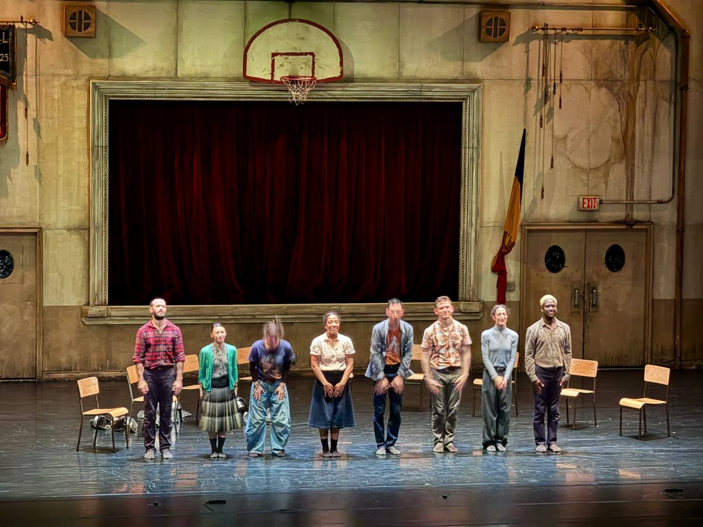
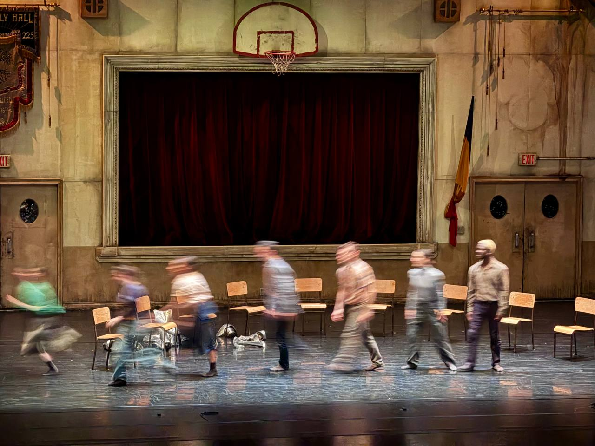
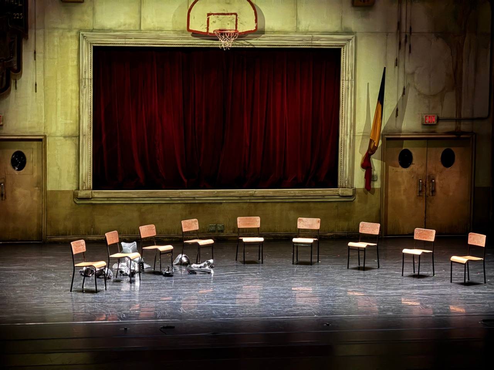

# 《集會遊戲》觀後

5/28 晚上，我在兩廳院看了 2026 TIFA 的開幕節目——加拿大編舞家 **Crystal Pite** 和劇作家 **Jonathon Young** 的《集會遊戲》（Assembly Hall），由他們共同創立的舞團 Kidd Pivot 演出。

戲很短，九十分鐘。一齣以「業餘中世紀重演社團的年度大會」為框架的舞蹈劇場——一群人圍著一圈木頭折椅，照著 **Robert's Rules**（美國通用的議事規則）開會，最後一條議程是要不要解散這個社團；同時間，他們開會的台詞變成中世紀亞瑟王傳奇的角色台詞、肢體像被聲音操控的木偶、銀色盔甲落在地上、空椅取代了缺席的人。

戲一結束，我跟太太在演後座談就一路討論——當下覺得**有一條觀察，我看過的中英劇評好像都沒有完整講過**。後來花了一些時間回去 fact-check，這篇是整理。

*謝幕。九張椅子，八個人。*

---

## 🪑 戲一開始就「少了一個」

戲一開始，舞台上有 **九張木頭折椅**。但只坐了 **八個人**。

到中段，他們開始照議事規則辯論。常用的「**Madam Chair**」、「**Mr. Chair**」這些英文台詞，在每張椅子之間繞來繞去。最關鍵的台詞之一是：

> **"The Chair cannot vote."**
> **"Behold the chair of the absent one."**

中文字幕只能擇一翻——翻成「**主席不能投票**」，或者翻成「**注視那把缺席者的椅子**」。**兩種譯法都對，但都只翻一半**。

英文裡 **chair** 同時是「**主席（職權）**」與「**椅子（物件）**」。
而 **The Chair cannot vote**——同時暗示「**主席不能投票**」（議事規則），也暗示「**那張空椅本來就沒人**」（物理事實）。

所以從一開始，這個「集會」就**根本不夠人數投票**——本來就是個會議學上的笑話、也是個存在論上的笑話。
最後決定解散這個集會的「**那一票**」，也是由那個「**像空椅一樣被忽略的人 / 戲劇本身的化身**」投下去的。

如果這齣戲在英文是 chair 的雙關，那中文字幕**從第一句就漏了一半**。

而且不只台詞層面——**舞台空間本身也在玩這個雙關**：椅子是物件、椅子是位置、椅子是權力、椅子是缺席者的紀念碑。**英文觀眾看到的是一張椅子有四種意思，中文觀眾看到的可能只有一種**。

---

## 🔍 fact-check：英文劇評有人說、中文劇評幾乎沒人寫

能在公開網路上找到的劇評裡，**這條線在英文評論裡有 4-5 篇隱約碰到**，但**中港台中文評論裡幾乎找不到完整指出來的**。

### 英文劇評有人摸到雙關

加拿大《**Stir**》最接近這個觀察：直接點出 Jonathon Young 的劇本玩「**wordplay and ideas**」，特別玩 Robert's Rules 的會議語言——`points of order`、`motions to move`、`unfinished business`，並引用了 **"Behold the chair of the absent one"** 這句台詞，解讀為「**缺席者的在場 / absent-presence**」。

加拿大評論家 **Colin Thomas** 把投票結構講得很清楚：**chair 不能投票，剩下成員 3 比 3 平手，所以 Dave 變成決定票**；甚至寫到 Dave 「**無足輕重到他的椅子幾乎也像是空的**」（his chair might as well be empty）。

**The Dance Current** 寫到「**empty chair 母題**」、「**the one containing multitudes**」反覆出現，最後解讀為：「**也許我們都是那位騎士，有能力改變故事**」。

**CriticalDance** 的 Stuart Sweeney 完整寫了結尾的儀式——AGM 最後一條 unfinished business 是否關閉協會，Dave 仍穿著盔甲、拿不定主意，最後死去，委員會把他的盔甲拆下、每人拿一塊、最後共同把盔甲組合起來紀念他。

**The Reviews Hub** 寫了視覺：白騎士進場 → 銀色盔甲被「肢解」→ 八位舞者各舉一塊 → 重新組裝成「**木偶白騎士**」。

### 但中文評論幾乎沒人寫

**La Vie** 專訪 Jonathon Young 提到「**為缺席者（Absent One）甚至是死亡本身預留一個位置**」——已經非常接近「空椅」意象，但**沒有指出 chair 同時是「主席」與「椅子」這層雙關**。

**Bazaar、500 輯、ELLE** 等台灣文章大多談「集體、秩序、議事規則、語言與身體」，**沒有討論雙關失落**。

**中國大陸**演出名稱叫《**禮堂異聞錄**》（也是個有趣的譯法選擇——強調「禮堂」這個空間，而不是「集會」這個行為），豆瓣與搜狐文章主要是介紹，**沒有處理雙關翻譯問題**。

**所以這個觀察的原創性是真的**——這層 chair 雙關，在中文劇評圈幾乎沒人完整寫過。

---

## 🃏 整個劇本，其實是一張會議桌的雙關層

如果接著這條線往下推，整齣《集會遊戲》可以拆成五層 **chair-pun 機關**：

| 層級 | chair 的意義 | 戲劇功能 |
|---|---|---|
| **議事權** | 主席（具有職權）| 「The Chair cannot vote」推動劇情往「平手 / 決定票」走 |
| **物件** | 椅子（傢俱）| 場景中無處不在，從一開始就有「九張椅子八個人」的視覺缺額 |
| **位置** | 一個座位、一個席次 | 「為缺席者預留一個位置」、Dave 是被推上空椅的局外人 |
| **權力** | 權柄（the chair = 元首級的位置）| 中世紀亞瑟王故事的對應——空王座、新騎士、王廷 |
| **缺席** | 一張空椅 = 缺席者的紀念碑 | 戲的存在論核心——「Behold the chair of the absent one」 |

**英文觀眾**因為 chair 一字承載全部五層，所以「**會議的笑話**」和「**存在的悲劇**」**是同一句話**。
**中文觀眾**因為翻譯只能擇一，所以「**會議的層次**」和「**存在的層次**」會被翻成**兩條平行線**——
你以為前半段在搞笑（議事規則），後半段在悲劇（缺席的英雄）；
**但其實英文觀眾從第一句台詞開始，就同時聽到兩件事**。

中文翻譯把雙關語拆掉了。

*動態模糊裡，椅子比人還清楚。*

---

## 📜 還有另一個翻譯——「unfinished business」

戲的最後一條議程，正式名稱叫做 **"Unfinished Business"**。

在 Robert's Rules 裡，這是議事規則的標準術語，**台灣議會中譯通常是「待討論事項」或「未盡事宜」**。中文字幕也大多翻成這幾種。

但這個翻譯**太行政、太瑣碎了。"Unfinished Business" 在這齣戲裡指的不是議程，是「未竟之業」**。

這個劇用 unfinished business 一語雙關——

- 表層：**會議還沒處理完的最後一條議程**（行政術語）
- 中層：**Dave 這個騎士來訪的任務沒完成**（中世紀傳奇）
- 深層：**所有人類的歷史、救贖、生命都是 unfinished business**（存在論）

**「未竟之業」更能保留三層的同步感**。

「待討論事項」、「未盡事宜」這種譯法**把存在論的味道全部洗掉**——只剩會議室。

---

## 🛡️ 銀色盔甲、解散的票、跟「故事自己終結自己」

戲的結尾發生了三件事，**英文評論各自抓到其中一兩件，但我沒看到有人完整串起來**：

1. **AGM 最後一條議程是「unfinished business」——是否解散這個集會**
2. **Dave**——那個被勉強拉上空椅的局外人、那個一直拒絕說話的新人——**投下了關鍵票**
3. **戲結束之後，Dave 死了，眾人把他的盔甲拆解、八個人各拿一塊、組合成一個「會跳舞的木偶白騎士」**

我的詮釋是：

> **戲劇的核心機關，是「故事自己投票終結自己」**。
>
> Dave 從頭到尾不像一個活人——他像「**那把空椅子**」的化身、像「**戲劇本身**」披上了盔甲的化身。
> 當他投下那一票（不管是贊成解散還是反對解散——評論間有出入，這個歧異本身可能就是劇場設計的一部分），
> 他終結的不是集會，是「**這個故事**」。
> 然後他死掉，眾人把他的「外殼」（assembly = 組裝起來的物件）拆開，
> 再重新 **assemble**（組裝）成一個會動的傀儡——
> **戲劇 → 解散自己 → 變回零件 → 被觀眾組裝回來繼續活下去。**

英文 **assembly** 同時是「**集會**」（會議）和「**裝配**」（把零件組合起來的動作）。

**這就是整齣戲的最深一層雙關**——「**The Assembly is Dissolved**」既是「**集會解散**」，也是「**這個（被組裝起來的）東西被拆解**」。

戲劇被組裝起來、被演出來、被拆掉、再被觀眾重新組裝在記憶裡——
**戲劇本身就是一個 unfinished business**。

*集會結束。盔甲落地。椅子還在原位。但人都走了。*

---

## 📌 翻譯的失落，是不是只能認了？

英文 chair / assembly / unfinished business 這三個字在《集會遊戲》裡都是**單字承載多重意義**的設計——這是英語拼音文字 + 議事規則文化 + 存在論傳統的三重疊加。

中文字幕的譯者**不是不知道雙關**——是**中文找不到一個字同時是「主席」和「椅子」**。

「**席**」字勉強行——「主**席**」、「**席**位」、「**席**地而坐」——但離「椅子」這個物件還是有距離。
「**位**」字也勉強——「**位**子」、「**位**置」、「就**位**」——但離「議事權」更遠。

**有沒有可能用「字幕加註」或「節目冊註解」處理？**

未來如果還有機會引進這類**高度依賴語言雙關**的當代劇場，台灣的劇場字幕設計可以考慮：

1. **節目冊明寫**：「**chair = 主席 / 椅子；本劇核心機關建立在此**」
2. **關鍵場次字幕雙寫**：「主席（chair）不能投票」——讓觀眾自己腦補
3. **演後座談特別說明**這個翻譯選擇

否則就是——
英文觀眾聽到「**The Chair cannot vote**」的時候會內心發出一個小小的「啊」，
中文觀眾聽到「主席不能投票」會想：「**喔，原來他們在搞 Robert's Rules**」。

**同一句話，兩種觀眾經驗。**

這篇文章如果有一個目的，就是讓**之後看《集會遊戲》（或它的巡演 / 重演）的中文觀眾**——
**能多看到一層**。

---

## 📚 參考評論（fact-check 來源）

| 媒體 | 抓到的層次 |
|---|---|
| **Stir**（加拿大）| Jonathon Young 劇本「wordplay」+「Behold the chair of the absent one」⭐⭐⭐ chair 雙關隱約 |
| **The Guardian**（英國）| "clever, fast-talking dialogue" + "recurring and unfinished business" ⭐⭐ 雙關沒講開 |
| **Colin Thomas Reviews** | chair 不能投票、3-3 平手、Dave 決定票、"his chair might as well be empty" ⭐⭐⭐ 投票結構最清楚 |
| **The Dance Current** | empty chair、the one containing multitudes、「也許我們都是那位騎士」⭐⭐ 後設層次 |
| **CriticalDance** | 盔甲拆解、儀式紀念、Dave 是來訪騎士 ⭐⭐ 結尾儀式完整 |
| **The Reviews Hub** | 八位舞者各舉一塊銀甲、組成會跳舞的木偶白騎士 ⭐⭐ 視覺最完整 |
| **La Vie**（台灣）| 「為缺席者（Absent One）甚至是死亡本身預留一個位置」⭐ 接近但未明說 |
| **中國大陸**（豆瓣 / 搜狐）| 演出介紹為主，譯名《禮堂異聞錄》 |

---

> **演出資訊**：
> 2026 TIFA 台灣國際藝術節｜Kidd Pivot《集會遊戲》Assembly Hall
> 編舞：Crystal Pite｜劇本：Jonathon Young
> 演出地點：國家戲劇院｜2026 年 5 月
> 票務：[OPENTIX 兩廳院文化生活](https://www.opentix.life/event/1983484841800200192)
> 演後座談：5/28（四）演出後於國家戲劇院大廳

---

## 📌 免責與說明

本文為**劇場觀後記與翻譯研究**，**不代表官方立場、不為任何劇團或機構代言**。文中對英文劇評的引用以理解轉述為主，原文連結見參考評論段；對中文翻譯選擇的討論不指涉任何特定譯者，僅作為「中英劇場翻譯如何處理單字雙關」的觀察。

本文觀點為個人意見，**不代表立法院或所屬政黨立場**。

— 葛如鈞（寶博士）／ 2026.05.31
