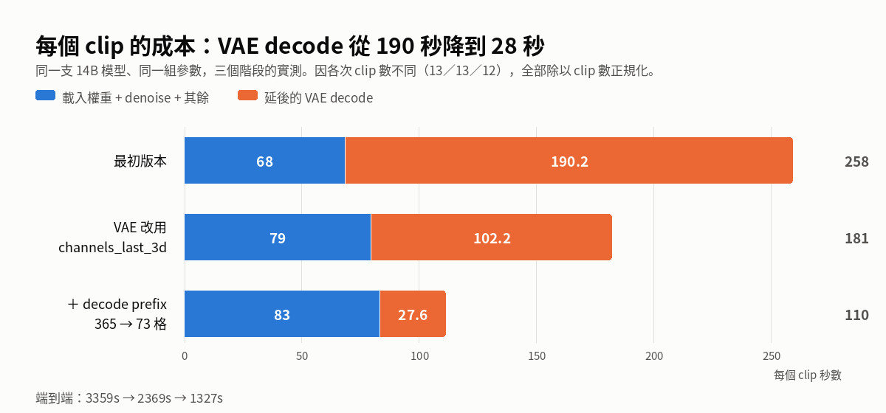
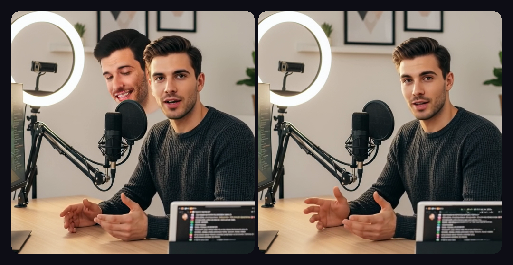
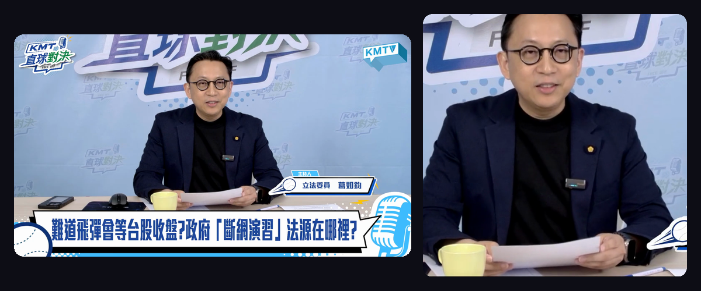

辦公室那台 DGX Spark（NVIDIA GB10，121GB 統一記憶體）閒著也是閒著，這幾天拿它做了一件事：把阿里巴巴 Quark 團隊開源的 **LiveAvatar** 移植上去，用我自己的一張照片、我自己的聲音，全程離線生出會說話的數位分身。

先看成果。這支影片的每一個畫素都是這台機器算出來的——臉來自一張靜態照片，嘴型來自一段本地合成的語音，動作來自另一段影片的姿態訊號，沒有任何雲端 API：

<video
  src="/images/liveavatar-dgx-spark/fullframe-pose-cosyvoice.mp4"
  poster="/images/liveavatar-dgx-spark/fullframe-pose-cosyvoice-poster.jpg"
  controls
  playsInline
  style={{ maxWidth: '100%', borderRadius: '12px', margin: '1.5rem 0' }}
>
</video>

| | |
|---|---|
| 硬體 | DGX Spark（GB10、sm_121、**aarch64**、121GB 統一記憶體） |
| 影像模型 | Wan2.2-S2V-14B（14B 參數）＋ LiveAvatar LoRA，共 47GB |
| 語音模型 | CosyVoice2-0.5B，本地 zero-shot 聲音複製 |
| 精度 | FP8（`torch._scaled_mm`） |
| 單次產出 | 21 秒影片 / 896×512 / 525 格，**約 35 分鐘** |
| 花費 | 0 元 API 費 |

上游完全沒有針對這台機器做過任何調整——這篇就是「沒有人幫你鋪路時，怎麼自己鋪」的實錄。

## 先科普：這幾個東西是什麼？

### LiveAvatar：讓照片開口說話

給一張人像照片和一段語音，模型逐格生成「這個人正在說這段話」的影片。核心是 **Wan2.2-S2V-14B**（S2V = Speech to Video），LiveAvatar 在上面疊了一層 LoRA，把原本要 40+ 步去噪的擴散模型壓到 **4 步**，並改成串流式的分段生成——所以它能一段接一段無限生成下去，而不是只能吐 5 秒短片。

它還吃第二種條件輸入：**pose video**（姿態驅動影片）。你可以拿另一段影片的身體動作，套到目標人物身上。這是後面所有精彩踩坑的來源。

### DGX Spark：桌上型的統一記憶體怪物

這台機器的關鍵特徵有兩個，兩個都會咬人：

**第一，121GB 統一記憶體。** CPU 和 GPU 共用同一塊實體記憶體。好處是 14B 模型隨便放；壞處是「把權重搬到 CPU 省顯存」這種在一般顯示卡上的標準技巧，在這裡完全沒有意義（後面會看到我怎麼在這件事上摔一跤）。

**第二，`aarch64` 架構。** 這才是真正的痛點。x86 的 Linux 上 `pip install` 幾秒就好，因為 PyPI 上有預編譯好的輪子（wheel）；ARM 架構上很多套件根本沒有輪子，只能從原始碼編——而有些東西編一次要好幾個小時，還不保證編得過。

## 踩坑一：兩個裝不起來的相依套件，其實都不是必要的

`requirements.txt` 裡有兩個在 aarch64 上直接卡死的套件。**面對裝不起來的相依套件，第一件該做的事不是硬編，是先確認你真的需要它。**

### flash-attn：以為是引擎，其實是加速器

FlashAttention 是加速注意力計算的 CUDA kernel，沒有 ARM 輪子，從原始碼編到 sm_121 成本高得離譜。但讀完程式碼發現：這個檔案裡的 `attention()` 本來就會在找不到 flash-attn 時退回 PyTorch 內建的 SDPA——**問題出在隔壁那個 `flash_attention()`，它直接 `assert` 就掛掉**，而模型主體、motioner、序列平行三處都是直接呼叫它。

所以我補了一個 `sdpa_varlen_fallback()`，處理變長序列的 padding mask、causal 遮罩（要對齊 flash-attn 的 bottom-right 語意，不是左上角）、GQA。

重點是**驗證，不是「跑得動就算」**：拿 fp32 的 naive attention 當基準比對六種情境，誤差全部落在 bf16 精度內（`< 0.008`）。更關鍵的是，實際推論路徑上 `context_lens` 恆為 `None`——在這條路上 fallback 跟 flash-attn 是**完全等價**，不是近似。

### decord：影片讀取器，自己寫一個更好

decord 是讀影片影格的函式庫，同樣沒有 ARM 輪子，連社群 fork 的 `eva-decord` 也沒有。而它擋住的是 `--pose_video`——動作驅動整條路。

實際用到的介面只有三個（平均幀率、總長度、取指定影格），所以我自己寫了一個。**backend 是量出來的不是猜的**——兩個候選都試過，對同一支 1920×1080 / 60fps 的影片取前 1151 格：

| backend | 色彩 | 總影格數 | 讀 1151 格 |
|---|---|---|---|
| **imageio_ffmpeg** | 照容器的 BT.709 標記，**正確** | 27182（**對**） | 2.8s |
| cv2 | 一律 BT.601，最大差 20/255 | 27204（信了壞掉的檔頭） | 3.7s |

兩個坑都是實測踩到的，也都很有代表性：

1. **OpenCV 不理會影片的色彩空間標記**，一律用舊的 BT.601 係數做 YUV→RGB 轉換，每個畫素都有系統性偏差。把 ffmpeg 強制切成 BT.601 之後，兩邊位元完全相同——確認差異純粹來自色彩矩陣，取樣邏輯是對的。
2. **影片容器的「總影格數」欄位是錯的**：檔頭寫 27204，實際逐格數出來是 27182。cv2 信檔頭所以錯，imageio_ffmpeg 用「長度×幀率」估算反而對。

驗證方式一樣是逐格對位元：五個抽樣點跟 ffmpeg 直出的 RGB 完全一致。

<strong>教訓：相依套件清單是作者的環境快照，不是你的必需品清單。</strong>這兩個東西擋了整個專案，結果一個是效能優化、一個是薄薄的工具層。

## 踩坑二：編譯器太舊，而且關不掉

這是 GB10 上最陰的一個坑。GB10 的運算能力代號是 `sm_121a`，而 PyTorch 2.9.1 綁的 Triton 自帶的 `ptxas` 編譯器是 CUDA 12.8 版，**只認得到 `sm_120a`**，一碰到就噴：

```
triton.runtime.errors.PTXASError: Internal Triton PTX codegen error
```

系統上的 CUDA 13.0 版 ptxas 認得 `sm_121a`，指過去就好：

```bash
export TRITON_PTXAS_PATH=/usr/local/cuda/bin/ptxas
```

**陰的地方在於「關掉編譯」擋不住它。** 專案有個 `ENABLE_COMPILE` 開關，直覺上關掉就不會走到 Triton——但 FP8 量化函式 `quant_fp8()` 是**無條件**掛著 `@torch.compile` 的，跟那個開關無關。所以只要你用 `--fp8`，就一定會撞上。

## 效能：三次「先量再猜」的教訓

第一支影片跑出來是 2026 年 8 月 7 日早上。能跑之後，接下來一週的主軸只有一件事：**它太慢了**。二十幾秒的影片，要算將近一小時。

這段是整篇我最想分享的部分——因為我連續三次憑直覺猜錯瓶頸，而每一次都是「量一下」就當場打臉。

### 第一次：以為編譯會救我

`torch.compile` 的 `max-autotune` 是標準加速手段。實測它確實有效：去噪從 3.11 秒/步降到 2.18 秒/步，**快了 30%**。

但端到端從 882 秒變成 **906 秒——反而慢了**。

因為去噪只佔總時間的 11%。快 30% 只省下 29 秒，卻多付了編譯本身的開銷。**加速一個佔比 11% 的東西，天花板就是 11%。**

### 第二次：以為統一記憶體會讓 offload 變成白工

拆解之後發現有 59% 的時間不知道花在哪。最可疑的是 `--offload_model True`：這個選項會把模型權重在 CPU 和 GPU 之間搬來搬去，省顯存用的。而這台是統一記憶體——**CPU 和 GPU 是同一塊實體記憶體，搬個什麼勁？**

這個推論聽起來無懈可擊。實測結果：

| | `offload=True` | `offload=False` |
|---|---|---|
| 每個 block 成本 | 60.2s | 59.5s |

**差 1%，在雜訊裡。**

為什麼會猜錯？因為統一記憶體上 `.cpu()` 本來就不是真的搬資料——所以「省下搬運」根本沒有東西可省。我把 59% 歸因給 offload 純粹是**猜的，沒有量過**。

### 真兇：最後那一次 VAE 解碼

老老實實在每個階段插上計時器之後，兇手立刻現形：

| 階段 | 耗時 | 佔比 |
|---|---|---|
| 載入權重 + 合併 LoRA | 257s | 8% |
| 去噪（52 blocks × 4 steps） | 約 630s | 19% |
| **最後一次 VAE 解碼** | **≥ 2280s** | **≥ 68%** |

原因是這條路徑預設把 13 個片段的解碼**全部延到最後一次做**。VAE（把壓縮的潛在表示還原成畫素）本來就是重運算，一次解 589 格畫面就是這個下場。

有兩個看起來能救的官方參數，我沒有各燒一小時去試，而是**去讀原始碼**——兩個都是死路：`--enable_vae_parallel` 在單卡路徑被強制設成 `False`（要五張卡以上）；`--enable_online_decode` 的條件式寫成只解碼第 0 個片段，其餘照樣進延後迴圈，**總工作量完全沒變**。

真正有效的是把 VAE 的 3D 卷積權重換成 `channels_last_3d` 記憶體排列：解碼 34.4→18.3 秒、編碼 12.2→6.4 秒，**每個片段省 47%**。順帶一提，同批測試的 `cudnn.benchmark` 效果是 **0%**。

端到端：3359 秒 → **2369 秒（−29.5%）**。而且數值安全性有驗過：跟 fp32 基準比，最大誤差跟改之前**完全一樣**（3.591e-02）。

### 第三次：以為我知道張量有多大

改完之後出現一個怪現象：**同一段程式碼，我單獨測是每片段 24.7 秒，實跑卻是 102 秒。差四倍。**

我依序排除了四個假設——記憶體壓力讓 cuDNN 選了爛演算法（否，灌 40G 壓艙物也不動）、14B 模型佔著資源（否，把它搬走再測一樣）、GPU 降頻（否，全程 2450MHz、throttle 旗標乾淨）、專案動了後端旗標（否）。

最後讓實跑自己印出張量形狀。答案是：**我餵給測試的張量太小了。** 真實輸入解碼出來是 **413 格**畫面，不是我從設定檔推算的 121 格。413/121 = 3.4，正好就是那個「四倍」。

而為什麼是 413 格，才是真正有意思的地方：程式先把參考影格複製成 5 格（為了跳過因果 VAE 的邊界效應），**下一行又拿這個「已經是 5 格」的東西再複製 73 次**，變成 365 格。

**但模型根本吃不到那麼多。** 下游的 motioner 只讀最後 19 格，而且程式自己也算出了 19 這個數字、當成中繼資料傳給模型。**中繼資料說 19，張量卻是 92——這個不一致就是 bug 的指紋。**

於是那 73 格沒有人讀的資料，VAE 每個片段都要陪著解碼一次。修剪掉之後：

| 前綴長度 | 每片段耗時 | 最大誤差 |
|---|---|---|
| 365（原樣） | 103.2s | — |
| **73** | **27.0s** | 2.54e-02 |
| 33 | 16.6s | 5.27e-02 |

判讀基準是 bf16 本身的雜訊底 **3.591e-02**。選 73 不是隨便挑的——它就是程式自己假設的那個值。33 以下開始超過雜訊底，不取。



端到端從 2245 秒降到 **1327 秒（−41%）**。解碼佔比從 55% 掉到 25%，**去噪終於變成最大的一塊**。

三次的教訓是同一句話：**先量再猜。**而且第三次特別值得記——前兩次錯在「沒量就歸因」，第三次錯在**「我以為的數字不是真的數字」**。自己從設定檔推出來的形狀，會很有說服力地錯下去。

### 後記：那個「結案」的結論，後來翻盤了

寫這篇的時候我順手重跑了一次編譯開關——因為第一次結案的理由是「去噪只佔 11%」，而優化完之後**去噪佔比變成 58%**。前提變了，結論就該重驗。

同樣的參數、同樣 11 個片段，唯一變因是編譯開關：

| | 關閉（基準線） | 開啟 |
|---|---|---|
| 每步去噪 | 5.81 s/it | **4.18 s/it（−28%）** |
| 去噪 + 條件準備 | 1194.9s | 1069.9s（−10.5%） |
| 延後解碼 | 545.3s | 557.3s（+2.2%） |
| **端到端** | **2072s** | **1936s（−6.6%）** |

<strong>同一個開關，在 704×384 是淨損失，在 896×512 變成淨賺。</strong>技術本身沒變，變的是它佔比多少——這反而讓「先量再猜」這句話更完整：**一個當初正確的結論，會因為周圍的東西被優化掉而過期。**

但有個代價要講清楚：<strong>輸出不是同一支影片跑更快，是另一次取樣。</strong>編譯會換掉底層運算核心，浮點累加順序跟著變，而四步擴散又是一段一段接力生成的，微小差異會被放大。同一格比對下來，差異集中在人身上（臉手區域平均差 12.2），背景幾乎不動（1.15）——身分和場景都穩定，但手的位置、頭的角度確實不一樣了。

所以這個開關的正確用法是：**還在探索階段就開著，省 6.6%；一旦某支輸出通過了你的審片，要重現它就得維持同一組設定。**

## 動作驅動：模型不會幫你避開台標

姿態驅動這條路修好之後，第一支成品有背景髒點。而且更糟的是——**畫面裡憑空長出第二張臉。**



<video
  src="/images/liveavatar-dgx-spark/second-face-artifact.mp4"
  controls
  muted
  loop
  playsInline
  style={{ maxWidth: '100%', borderRadius: '12px', margin: '1.5rem 0' }}
>
</video>

原因查出來之後很合理：我拿來當動作來源的是一段電視節目，**畫面上有燒死的圖層**——左上角台標、下方黃色字幕條。而模型的前處理只做「等比縮放 + 置中裁切」，**台標和字幕條原封不動被當成姿態條件餵了進去**，佔畫面約三成。至於那第二張臉，就是驅動影片裡的那個人——他被當成場景的一部分畫進去了。

修法是先把驅動影片裁到只剩人。量化驗證（取「人不在」的背景區域，逐格跟無動作版本比對）：

| | 背景平均差異 | 最差一格 |
|---|---|---|
| 原始驅動影片 | 6.89 | 18.61 |
| **裁切後** | **2.38** | **12.09** |

**背景污染降 65%**，第二張臉和鬼影消失。

給之後要做這件事的人兩條通則：

1. **驅動影片要事先裁成「只有人、正方形、沒有任何疊加圖層」。** 前處理不會幫你避開浮水印、字幕、台標——它只會等比縮放然後從中間切一塊。
2. **驅動影片的取景要盡量貼近目標照片**（人在畫面裡的大小和位置）。差太多的話，姿態訊號的「肩膀／桌面」會落到目標場景的「環形燈／層架」上，殘留在背景。



套用到自己的素材時，光是「把裁切框調成兩邊人頭大小相當」這件事，我就靠並排比對迭代了三次——而且一開始還判斷反了。

## 聲音：一個聽起來完全正常的錯誤

三家 TTS（ElevenLabs、HeyGen、本地 CosyVoice2）用同一張照片、同一個隨機種子跑過同樣的流程。結論很乾脆：**每個片段的解碼成本三支完全一致**（27.6 / 27.5 / 27.6 秒），端到端的差異純粹來自音檔長度決定的片段數。**所以選語音後端只需要考慮音色，不用考慮算圖成本**——本地 CosyVoice2 既不用外部 API 也沒有比較慢（合成 21 秒語音只要 15 秒）。

但這裡有一個**會靜默發生**的坑，我想特別提出來，因為它差點就這樣混進成品。

**CosyVoice2 只吃簡體中文。** 同一段文字、同一個參考音，只差繁簡：

| 輸入 | 逐字聽寫相符度 |
|---|---|
| 繁體 | **0.567** |
| 簡體 | **1.000** |

繁體進去會唸成「資料治理→細料治理」「產業、學界→禪教、Gati、Gashi」。它的分詞器是簡體語料訓練的。

<strong>可怕的地方在於：破掉的音檔聽起來仍然像正常在講話，嘴型也對得上，影片看起來一切正常。</strong>不做逐字聽寫比對根本不會發現。我 8 月 7 日那支已經做成影片的版本就是破的（相符度 0.589），當下完全沒看出來。修法很簡單，輸入端先轉簡體就好，輸出的語音還是台灣腔國語。

挑選參考音的方法也值得記一筆：**兩個指標都要量，只量音色會選到講話破掉的候選**（第一版就踩到）。內容正確性用 whisper 逐字聽寫比對、音色相似度用聲紋嵌入比對一段「任何候選都沒用到」的真實語音。實測發現兩個效應分得很乾淨——換成同一支影片的音源，音色相似度從 0.466 跳到 0.688；再拉長參考音到 25 秒，升到 0.735。但**參考音太長內容會崩**：貼近 30 秒上限的那個候選，三次合成全部破掉，連提示文字都洩漏進輸出。

## 最後：解析度的天花板在哪裡

原本輸出是 512×512 的臉部特寫。要做成「不裁切、整個新聞棚都在畫面裡」的全幅版本，發現一個硬限制。

畫面裝越多東西，臉佔的畫素就越少——所以全幅一定要同時拉高解析度，否則臉只剩 47 畫素高。而解析度的上限不是模型大小，是 **KV cache**：

| 輸出 | KV cache | 實測峰值記憶體 |
|---|---|---|
| 704×384 | 38.7G | 58.5G |
| **896×512** | 65.6G | **88.3G** |
| 1088×640 | 99.6G | 125G（**放不下**） |

（順帶一個有趣的發現：程式裡那個 `for gpu_id in range(4)` 看起來是配給 4 張顯示卡的，其實是配給 **4 個去噪步驟**的——所以單卡也砍不掉。）

121GB 的機器，天花板就是 896×512。這也是為什麼最終成品是這個尺寸。

還有一個細節：「不裁切」實際上會產生黑邊，因為輸出邊長會被對齊到 64 的倍數，比例永遠不會剛好等於 16:9。我寫了個小工具反解出「剛好對齊」的來源裁切——修掉 28 個畫素寬（原圖的 1.5%），**零黑邊零裁切**。

最終六支影片（三種聲音 × 有無動作），臉、腳本、解析度全部相同：

| 聲音 | 純音訊 | ＋動作 |
|---|---|---|
| HeyGen | 2291s | 2486s |
| ElevenLabs | 2210s | 2286s |
| **本地 CosyVoice2** | **2072s** | **2156s** |

六支的峰值記憶體都是 88.3G，一模一樣。這是純音訊驅動的版本，可以跟開頭那支有動作的對照著看：

<video
  src="/images/liveavatar-dgx-spark/fullframe-audio-only.mp4"
  poster="/images/liveavatar-dgx-spark/fullframe-audio-only-poster.jpg"
  controls
  playsInline
  style={{ maxWidth: '100%', borderRadius: '12px', margin: '1.5rem 0' }}
>
</video>

一個意外的結果：**開頭那支有動作驅動的影片，下方字幕在 525 格裡全程清晰可讀**——抽了十個時間點檢查，連那個逗號都在。模型是每一格從潛在表示重畫那些字的，本來不該撐得住。

不過**上面這支純音訊的就會糊掉**：同一段字，在第 60 格整條糊成一團，中段的標點也不穩。兩支的差別只有「有沒有姿態條件」——看起來姿態訊號順便把畫面的幾何釘住了，連背景那些燒死的圖層一起受惠。這是 n=1 的觀察，還不足以當成通則，但如果你也要生成帶字幕的畫面，值得往這個方向試。

最後附上第一天跑出來的那支——官方範例的臉、3.7 秒、704×384。從這裡到上面那支，中間隔了一個禮拜：

<video
  src="/images/liveavatar-dgx-spark/first-clip.mp4"
  controls
  muted
  loop
  playsInline
  style={{ maxWidth: '100%', borderRadius: '12px', margin: '1.5rem 0' }}
>
</video>

## 必須說的話：這個技術的另一面

我把自己的臉、自己的聲音餵進去，做出一個會說話、會做動作的分身。整個過程在一台桌上型機器上、完全離線、大約 35 分鐘。

**把照片換成不是你自己的人，這就是深偽（deepfake）。**

這件事沒有任何技術門檻可言——沒有雲端服務的內容審查可以擋，因為根本不需要連網；沒有 API 金鑰可以撤銷，因為權重就在你的硬碟上。我做這次實驗前後最強烈的感受不是「好厲害」，而是<strong>「這已經是任何人都做得到的事了」</strong>。

我仍然主張開源。理由是：<strong>這條路已經存在，差別只在於防守方看不看得見它。</strong>能自己跑一遍，才知道破綻在哪裡（比如生成影片在背景的細微漂移、比如聲音複製對參考音長度的敏感），才知道偵測工具該往哪裡做，也才知道「數位身分驗證」這種法制討論該長什麼樣子。看不見的威脅才是最危險的威脅。

實務上請記得：<strong>公開場合的影片和聲音，就是別人訓練你的分身的素材。</strong>這次用的參考音只需要 25 秒。

## 附錄：規格與時間帳

- 硬體：DGX Spark（GB10、sm_121、aarch64、121GB 統一記憶體）
- 環境：Python 3.11 + PyTorch 2.9.1+cu130，CUDA 13.0
- 模型：Wan2.2-S2V-14B ＋ LiveAvatar LoRA（47GB）、CosyVoice2-0.5B
- 跳過的相依套件：`flash-attn`（改用 SDPA fallback）、`decord`（自寫 ffmpeg reader）、`deepspeed`／`sam2`／`insightface`（單卡路徑用不到）
- 修掉的上游 bug 四個：壞掉的 TTS import、`offload_model=False` 時 VAE 沒搬回 GPU、寫死的條件快取大小、以及那個沒人讀的 73 格前綴
- 效能：端到端 3359s → **1327s**（同樣 12–13 個片段）
- 這台機器平常跑著一個本地大語言模型，會吃掉 121GB 中的 87GB——跑這個之前得先把它停掉

老話一句：科技的民主化，從願意自己動手開始。而動手的另一個收穫是，你會知道該擔心什麼、不該擔心什麼。

---

## 附註：關於使用中國大陸開源專案的提醒

這次用到的三個東西——LiveAvatar（阿里巴巴 Quark 團隊）、Wan2.2-S2V（阿里巴巴 Wan 團隊）、CosyVoice2（阿里巴巴 FunAudioLLM 團隊）——**全部來自中國大陸的公司**。這裡以立法委員的身分補充幾點提醒。

我的立場一貫：**開放權重、開源專案無國界**，好的技術值得學習與使用，這篇文章就是示範。但這次的情況跟我之前寫過的本地語言模型有一個重要差異，值得說清楚：

**一、這次不只是下載權重，是執行對方的程式碼。** 語言模型的權重是「資料」，用你信任的引擎去讀它；但這種完整專案是**可執行的 Python 程式**，跑起來就有完整的檔案系統和網路權限。供應鏈風險的層級完全不同。實務上請從官方 GitHub 與官方 Hugging Face 儲存庫取得（本文用的是 `Alibaba-Quark/LiveAvatar`、`Wan-AI/Wan2.2-S2V-14B`、`Quark-Vision/Live-Avatar`、`FunAudioLLM/CosyVoice2-0.5B`），不要從轉傳連結或不明鏡像下載，並且在隔離的環境裡跑。順帶一提，這幾個專案的授權都是相當寬鬆的 **Apache 2.0**——比我上次寫的那兩個模型的「社群授權」乾淨得多。

**二、這類模型的風險不是「審查」，是「濫用」。** 語言模型的政治偏見會表現在拒答或按官方口徑回答；但影像與語音生成模型不會拒答，它只是忠實地執行你給的條件。它的風險不在模型有什麼立場，而在**這個能力本身**——三十秒的公開影片就足以複製一個人的臉和聲音。這是全球共同的問題，跟開發者的國籍無關。

**三、開源在這裡的價值特別具體：全程可離線、可稽核。** 這次的產出沒有任何一個位元離開過辦公室——照片、聲音、成品都沒有上傳到誰的伺服器。這對處理選民陳情、法案研究的國會辦公室不是小事。而且因為原始碼在手上，我們才能讀出「那個參數其實只解碼第一個片段」「那個張量比模型需要的大了四倍」這種事，並且動手修掉。**閉源服務只會給你一個比較慢的結果，不會給你一個可以修的理由。**

一個誠實的註腳：Apache 2.0 授權管的是「你能怎麼用這些程式碼與權重」，管不了「你拿它生成什麼」。技術授權從來不是內容治理的替代品——後者是我們這些寫法律的人的工作。
