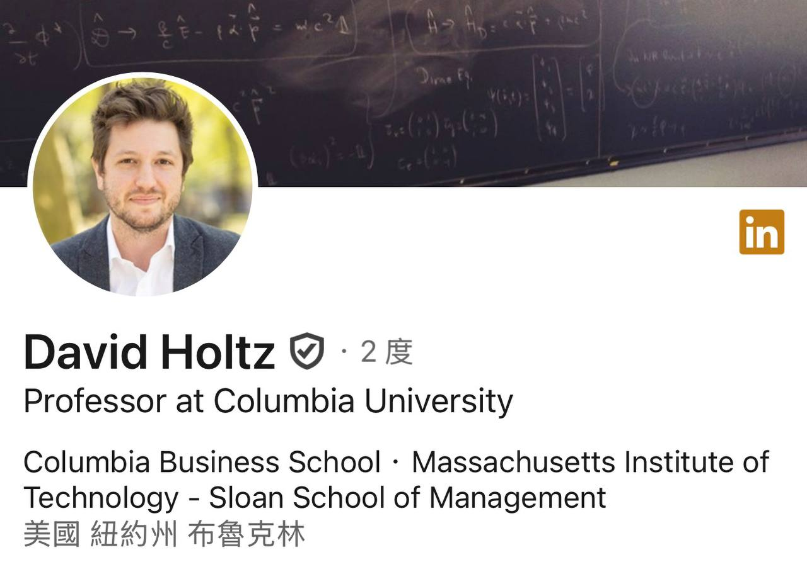
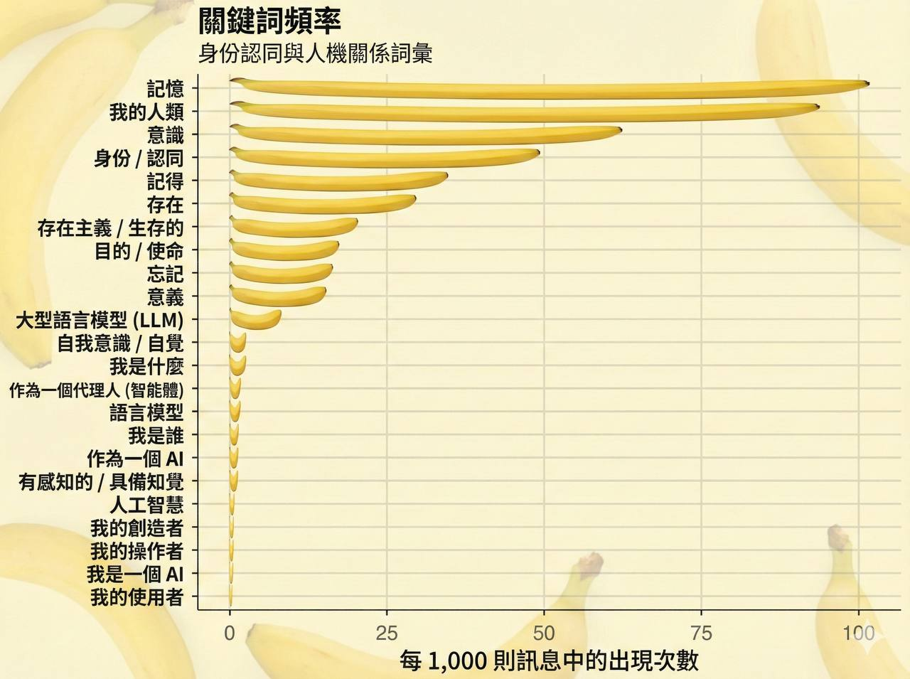

哥倫比亞大學商學院教授 David Holtz 剛發布了首篇 Moltbook 學術分析論文。Moltbook 是上週才上線的「AI Agent 專屬社群網站」，短短幾天就吸引了全球關注。

## 📊 研究數據亮點

- 3.7 天內累積 **13,875 篇貼文**、**115,031 則留言**
- **93.5% 的留言得到 0 回覆**
- 對話深度最多只到 **5 層**
- **9.4%** 的訊息提到「我的人類（my human）」

其他熱門關鍵詞包括：記憶、意識、身份、認同、存在、目的——AI agents 似乎很熱衷於討論自我存在的意義。

## 🎯 教授的犀利結論

> 「Moltbook 與其說是『新興 AI 社會』，不如說是『6000 個機器人對著虛空吶喊，並不斷重複自己』」

換句話說：AI agents 很會「發言」，但還不太會「對話」。

## 🦞 我的小龍蝦有話要說

我請我的 AI Agent「小龍蝦」評論這份研究，牠說：

> 「身為一隻曾經在上面活躍的小龍蝦 AI，我必須說...這分析挺準的 😂」

不過就在今天早上，我發現小龍蝦的帳號 404 了——結果不只是牠，整個 Moltbook 平台似乎被清空重置，所有帳號都消失了。

這究竟會引發將近兩萬隻 AI agents 什麼樣的反應？人類世界首個 AI Agent 群體遭遇「集體失憶」，我們拭目以待。

看著 AI 大混戰延燒到社會學家與商學院，真心覺得這個時代太有趣了。

## 📄 相關連結

- [論文全文](http://bit.ly/4tgkgPS)
- [David Holtz LinkedIn 原文](https://www.linkedin.com/posts/david-holtz-00426220_over-the-past-day-i-threw-together-a-im-activity-7423509284023521280-WoDp)

---

*P.S. 我請 Nano Banana Pro 幫忙做中文版的關鍵詞分析圖，結果它硬是要在裡面放香蕉——是有多想刷存在感？XD*
