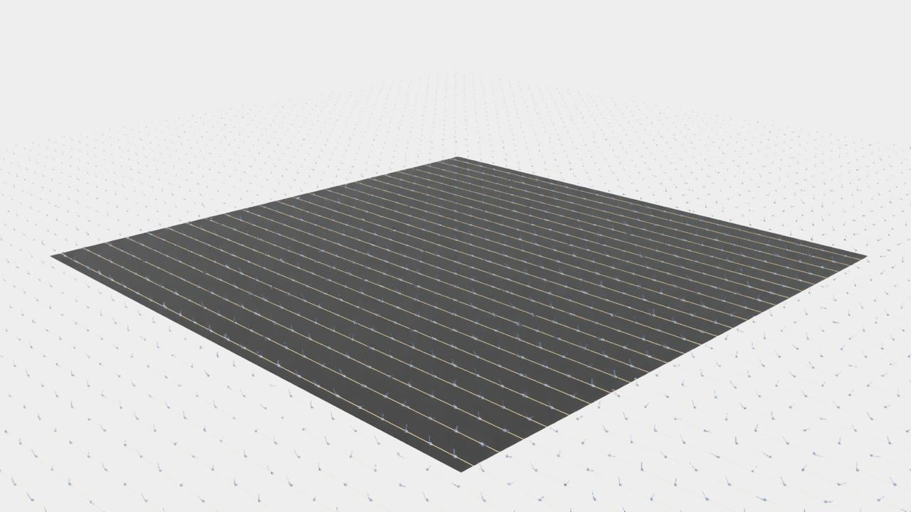
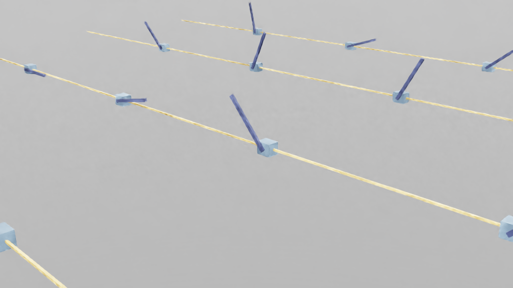
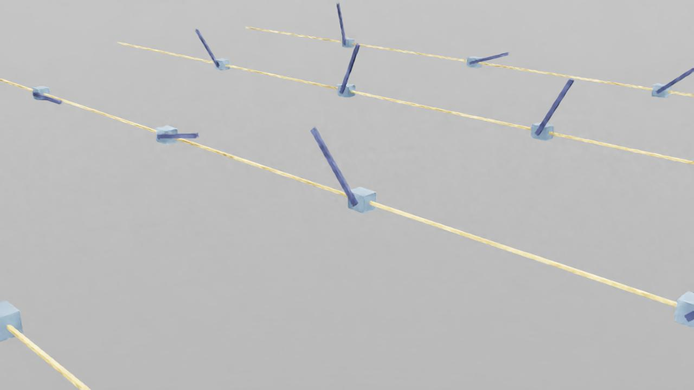
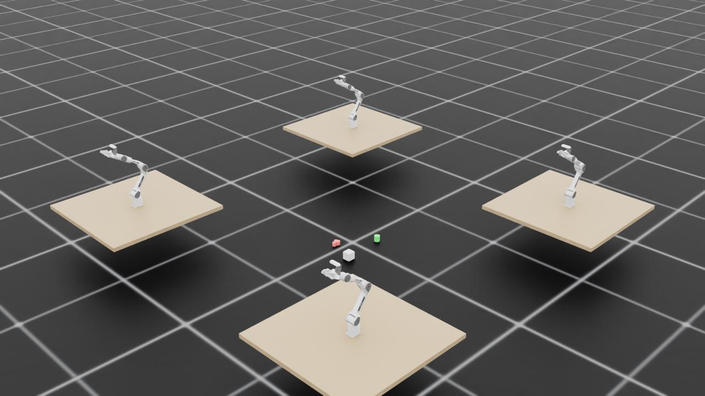
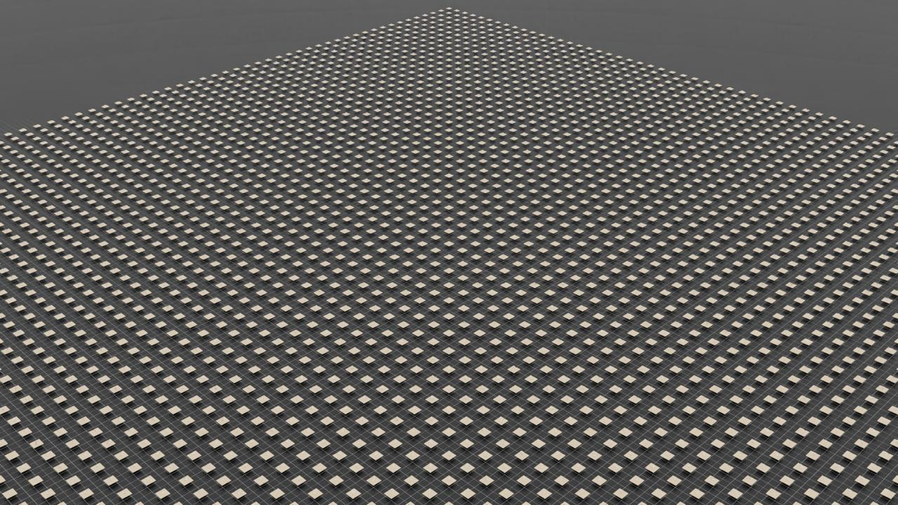
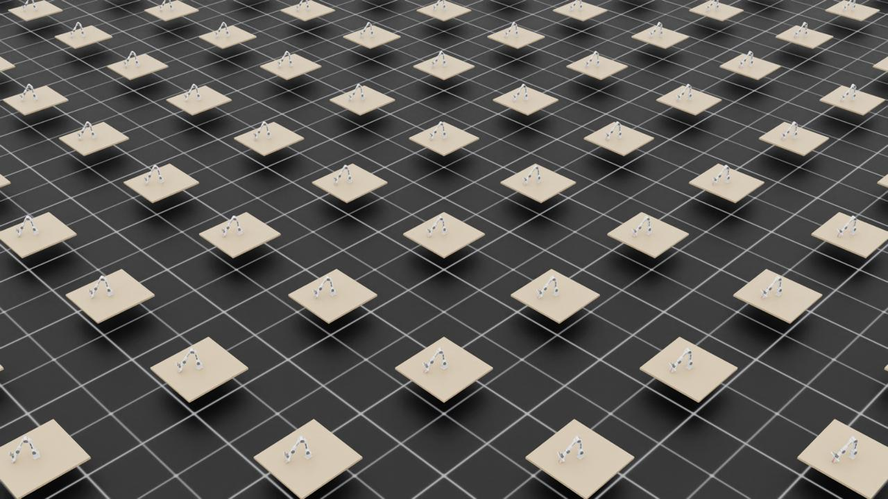
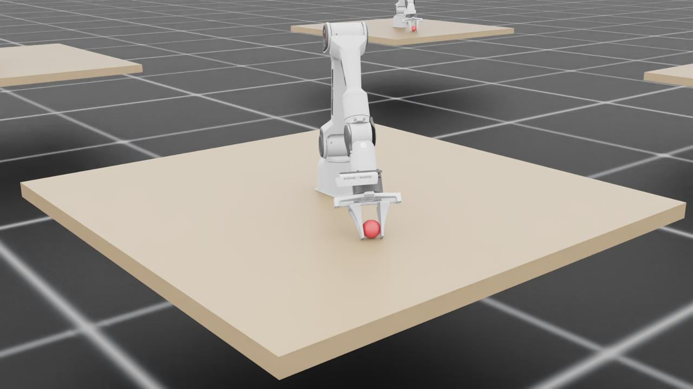
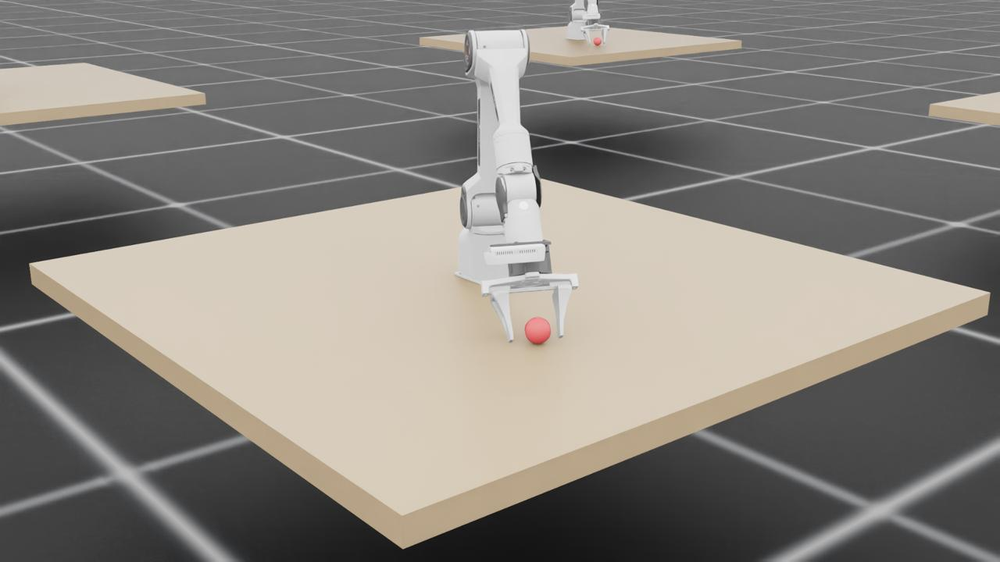

## 🤖 為什麼要在雲端跑 Isaac Sim？

我們正在做一個叫 **OpenClown** 的計畫 — 教一隻 AgileX PiPER 機器手臂拋接球。訓練 RL policy 需要幾千個平行模擬環境同時跑，這件事只有 GPU 做得到。

本地沒有 H200，所以我們選了 **Nebius AI Cloud**（歐洲 + 美國都有節點），搶佔模式 **$1.45/hr**，性價比很好。

但裝 Isaac Sim 的過程... 是一場三天的 Vulkan 除錯之旅。

---

## 📋 環境概覽

| 項目 | 規格 |
|------|------|
| GPU | NVIDIA H200 SXM, 143 GB HBM3e |
| CPU | 16 vCPU (Intel Sapphire Rapids) |
| RAM | 200 GB |
| Disk | 200 GB NVMe SSD |
| OS | Ubuntu 24.04 |
| Driver | NVIDIA 580.126.09 (CUDA 13.0) |
| Region | us-central1 |
| 模式 | Preemptible（搶佔式，隨時可能被收回） |

---

## ⚡ Step 1：開 Nebius Instance

用 `nebius` CLI 一行搞定：

```bash
# 建 boot disk
nebius compute disk create \
  --parent-id project-xxx \
  --name openclown-boot \
  --type network_ssd \
  --size-gibibytes 200 \
  --source-image-id computeimage-xxx  # Ubuntu 24.04 + CUDA 13.0

# 建 instance
nebius compute instance create \
  --parent-id project-xxx \
  --name openclown-h200 \
  --resources-platform gpu-h200-sxm \
  --resources-preset 1gpu-16vcpu-200gb \
  --boot-disk-existing-disk-id computedisk-xxx \
  --boot-disk-attach-mode read_write \
  --network-interfaces '[{"name":"eth0","subnet_id":"vpcsubnet-xxx","ip_address":{},"public_ip_address":{}}]' \
  --preemptible-on-preemption stop \
  --preemptible-priority 3 \
  --recovery-policy fail \
  --cloud-init-user-data "#cloud-config
users:
  - name: ubuntu
    sudo: ALL=(ALL) NOPASSWD:ALL
    shell: /bin/bash
    ssh_authorized_keys:
      - ssh-ed25519 AAAA... your-key"
```

> 💡 **重要**：`cloud-init` 必須在 `instance create` 時就帶上，事後加不會生效（cloud-init 只在第一次開機跑）。如果忘了帶，要刪掉重建。

### 搶佔模式注意事項

- `recovery-policy` 必須是 `fail`（搶佔 instance 不支援 `recover`）
- IP 每次重啟都會變，要用 `nebius compute instance get <id>` 查新 IP
- 訓練要每 5-10 分鐘存 checkpoint（policy 網路很小，存檔 < 1 秒）

---

## 🐍 Step 2：基礎環境

```bash
# Miniconda
wget -q https://repo.anaconda.com/miniconda/Miniconda3-latest-Linux-x86_64.sh -O /tmp/miniconda.sh
bash /tmp/miniconda.sh -b -p $HOME/miniconda3

# 接受 TOS（新版 conda 會擋）
conda tos accept --override-channels --channel https://repo.anaconda.com/pkgs/main
conda tos accept --override-channels --channel https://repo.anaconda.com/pkgs/r

# 建環境
conda create -n openclown python=3.11 -y
conda activate openclown

# PyTorch + Isaac Sim
pip install torch torchvision --index-url https://download.pytorch.org/whl/cu124
pip install isaacsim-rl isaacsim-replicator isaacsim-extscache-physics \
    isaacsim-extscache-kit-sdk isaacsim-extscache-kit isaacsim-app \
    --extra-index-url https://pypi.nvidia.com

# IsaacLab
git clone https://github.com/isaac-sim/IsaacLab.git
cd IsaacLab
echo "Yes" | ./isaaclab.sh --install  # 自動接受 EULA
```

到這裡為止都很順利。然後就掉進了 Vulkan 的坑。

---

## 🔥 Step 3：Vulkan 地獄

### 症狀

```
ERROR: vkCreateInstance failed. Vulkan 1.1 is not supported.
PhysXFoundation: Unable to get IGpuFoundation, GpuDevices or Graphics!
```

Isaac Sim 需要 Vulkan 來初始化 GPU，即使是 headless 模式也一樣。但 Nebius 的 CUDA image 只裝了 **headless driver** — 有 CUDA，沒有 Vulkan/GL。

### 為什麼 HPC Cloud 沒有 Vulkan？

Datacenter GPU image 通常只裝 compute driver（CUDA、cuDNN），不裝 display driver（Vulkan、OpenGL、GLX）。因為大部分 HPC workload（LLM 訓練、科學計算）不需要圖形渲染。

但 Isaac Sim 底層是 Omniverse Kit，即使不渲染畫面，也需要 Vulkan 來初始化 PhysX GPU pipeline。

### ❌ 嘗試 1：用 Docker

```bash
docker pull nvcr.io/nvidia/isaac-sim:5.1.0
```

Docker 裡有 `nvidia_icd.json`，但它透過 `--gpus all` 掛載 host 的 driver libs。Host 沒有 Vulkan libs → container 裡也沒有 → 一樣炸。

### ❌ 嘗試 2：apt-get install

```bash
sudo apt-get install libnvidia-gl-580
# E: Package 'libnvidia-gl-580' has no installation candidate
```

Nebius 的 apt repo 沒有這個套件。NVIDIA 官方 CUDA repo 也沒有（580 太新）。

### ❌ 嘗試 3：.run 安裝檔

```bash
wget https://us.download.nvidia.com/tesla/580.126.09/NVIDIA-Linux-x86_64-580.126.09.run
sudo bash NVIDIA-Linux-x86_64-580.126.09.run --no-kernel-modules --silent
# ERROR: alternate driver installation detected. Abort.
```

Installer 偵測到系統已經用 package manager 裝了 driver，拒絕覆蓋。

### ⚠️ 嘗試 4：手動解壓 + 複製 .so 檔（半成功）

```bash
# 解壓但不安裝
bash NVIDIA-Linux-x86_64-580.126.09.run --extract-only
cd NVIDIA-Linux-x86_64-580.126.09

# 複製所有 user-space libs
sudo cp *.so.* /usr/lib/x86_64-linux-gnu/

# 建立 symlinks
cd /usr/lib/x86_64-linux-gnu/
sudo ln -sf libGLX_nvidia.so.580.126.09 libGLX_nvidia.so.0
sudo ln -sf libEGL_nvidia.so.580.126.09 libEGL_nvidia.so.0

# 安裝 Vulkan ICD
sudo cp nvidia_icd.json /usr/share/vulkan/icd.d/

# 更新 linker cache
sudo ldconfig
```

這個方法能讓 `vulkaninfo` 看到 NVIDIA H200，**PhysX GPU 物理模擬也能跑**。但實測發現：

- **PhysX GPU 物理模擬** ✅ 可以跑
- **RTX 渲染/截圖** ❌ 失敗（shader compilation 卡住、replicator 無法輸出 frame）

手動複製 `.so` 檔只能騙過 `vulkaninfo`，但 Isaac Sim 的 RTX renderer 需要完整的 driver stack。

### ✅ 真正的最終解法：用 Driverless Image 重建 Instance

```bash
# 1. 在 Nebius 開 instance 時選 driverless image（不帶 NVIDIA driver 的 Ubuntu 24.04）
# image: ubuntu24.04-driverless

# 2. SSH 進去後，裝完整版 driver（含 Vulkan + OpenGL + RTX）
sudo apt-get install -y build-essential linux-headers-$(uname -r)
wget -q https://us.download.nvidia.com/tesla/580.126.09/NVIDIA-Linux-x86_64-580.126.09.run
sudo bash NVIDIA-Linux-x86_64-580.126.09.run --silent

# 3. 裝 Vulkan loader
sudo apt-get install -y libvulkan1 vulkan-tools

# 4. 驗證
vulkaninfo --summary
# GPU0: NVIDIA H200, apiVersion = 1.4.312, PHYSICAL_DEVICE_TYPE_DISCRETE_GPU ✅
```

> 💡 **關鍵差異**：Nebius 的 CUDA image 裝的是 **headless driver**（只有 compute，沒有 Vulkan/GL）。用 driverless image + 自裝完整 `.run` driver 才有完整的渲染能力。在 driverless image 上，`.run` installer 不會遇到「alternate driver installation detected」的問題，因為系統上根本沒有既有 driver。

---

## 🚀 Step 4：驗證 IsaacLab GPU 平行

先跑個基本的 CartPole 確認一切正常：

<video 
  src="https://ipfs.juchunko.com/ipfs/bafybeiey2tw4e3ilg4rnbxen5skgzfymkvuhf7fzm6cqzotq457vlj4w34" 
  controls 
  autoPlay 
  muted 
  loop
  playsInline
  className="w-full max-w-2xl rounded-lg my-4"
  style="border-radius: 8px; margin: 1rem 0;"
/>

*CartPole RL — 經典的 inverted pendulum balancing task，GPU 上跑起來絲般順滑。*

```python
from isaaclab.app import AppLauncher
app = AppLauncher(headless=True)
sim_app = app.app

from isaaclab_tasks.direct.cartpole.cartpole_env import CartpoleEnv, CartpoleEnvCfg
import torch

cfg = CartpoleEnvCfg()
cfg.scene.num_envs = 4096
env = CartpoleEnv(cfg)
obs, _ = env.reset()
print(f"4096 envs on GPU ready!")

# Benchmark
action = torch.zeros(4096, 1, device="cuda:0")
for i in range(1000):
    obs, rew, term, trunc, info = env.step(action.uniform_(-1, 1))
```

```
|---------------------------------------------------------------------------------------------|
| Driver Version: 580.126.09    | Graphics API: Vulkan
|=============================================================================================|
| GPU | Name                             | Active | GPU Memory |
|---------------------------------------------------------------------------------------------|
| 0   | NVIDIA H200                      | Yes: 0 | 143771  MB |
|=============================================================================================|

Number of environments: 4096
Environment spacing   : 4.0
```

### GPU 全力 Benchmark 結果

| 環境數量 | 速度 | vs MuJoCo CPU |
|---------|------|---------------|
| MuJoCo CPU (32 process) | 3,400 steps/s | 1x |
| IsaacLab 256 envs | 47,000 steps/s | 14x |
| **IsaacLab 4096 envs** | **709,000 steps/s** | **209x** |

> 🚀 一張 H200 跑 4,096 個平行 cartpole 環境，達到 **70 萬 steps/s**。之前 MuJoCo 跑 10M steps 要 45 分鐘，現在 **14 秒**。

---

## 🎬 Step 5：RTX 渲染截圖和影片

重建 instance 後，Isaac Sim 的 RTX 渲染完全正常。這是 4,096 個 CartPole 同時跑的實況：

<video 
  src="https://ipfs.juchunko.com/ipfs/bafybeigl5ixmoq2wczo7zrgvq7imbgup2efywfyigyr2n4dyz5raf7elrm" 
  controls 
  autoPlay 
  muted 
  loop
  playsInline
  className="w-full max-w-2xl rounded-lg my-4"
  style="border-radius: 8px; margin: 1rem 0;"
/>

*4,096 個 CartPole 在 H200 上平行運行 — 709K steps/s，密密麻麻的小車各自平衡著桿子。*



*鳥瞰全景 — 每個都是獨立的 RL episode。*

近拍可以看到每個 CartPole 的細節：



*拉近看 — 藍色小車在黃色軌道上，深色桿子角度各異。*



*PiPER 機器手臂末端執行器的軌跡規劃視覺化 — 黃色線條是規劃路徑，藍色方塊和桿子顯示每個路點的位姿（pose）。*

渲染成果：

- 4,096 個 cartpole 的 1920x1080 RTX 渲染截圖 ✅
- 200 frames 影片錄製 ✅
- Replicator camera + annotator pipeline 正常 ✅

截圖方式（headless server）：

```python
import os
os.environ["DISPLAY"] = ":1"  # Xvfb

from isaaclab.app import AppLauncher
app = AppLauncher(headless=True, enable_cameras=True)
sim_app = app.app

# ... 建環境、跑 simulation ...

import omni.replicator.core as rep
import omni.kit.app

cam = rep.create.camera(position=(120, 120, 60), look_at=(0, 0, 0))
rp = rep.create.render_product(cam, (1920, 1080))
annot = rep.AnnotatorRegistry.get_annotator("rgb")
annot.attach([rp])

# 等待渲染（第一次需要 shader compile）
for _ in range(20):
    omni.kit.app.get_app().update()

data = annot.get_data()  # numpy array (H, W, 4) RGBA
```

> ⚠️ 需要先啟動 Xvfb：`sudo Xvfb :1 -screen 0 1920x1080x24 +extension GLX &`，並設定 `DISPLAY=:1`。

---

## 📝 踩坑清單

| # | 坑 | 解法 |
|---|-----|------|
| 1 | cloud-init 事後加無效 | 必須在 `instance create` 時帶，否則刪掉重建 |
| 2 | 搶佔 instance 不支援 `recovery-policy: recover` | 改用 `fail` |
| 3 | Nebius CUDA image 無 Vulkan | 用 driverless image 重建 + `.run` 安裝完整 driver |
| 4 | `.run` installer 拒絕覆蓋 package manager 安裝的 driver | 用 driverless image 避開衝突 |
| 5 | 手動複製 .so 能跑物理但不能渲染 | 不夠！必須用 `.run` 安裝完整 driver stack |
| 6 | Docker container 掛載 host driver，host 沒 Vulkan → container 也沒有 | 先在 host 修好 Vulkan |
| 7 | `conda create` 被新版 TOS 擋住 | 先跑 `conda tos accept` |
| 8 | IsaacLab env 用 torch tensor 不是 numpy | `action = torch.zeros(..., device="cuda:0")` |
| 9 | Xvfb 需要手動啟動 | `sudo Xvfb :1 -screen 0 1920x1080x24 +extension GLX &` |
| 10 | Isaac Sim RTX shader 第一次編譯要 1-3 分鐘 | 正常現象，shader cache 會存下來，之後不需重編 |
| 11 | SSH 跑長指令會斷線 | 一律用 `nohup python3 -u script.py > output.log 2>&1 &` |
| 12 | `enable_cameras=True` 需要 DISPLAY 環境變數 | 先啟動 Xvfb，設 `DISPLAY=:1` |

---

## 💰 成本

| 項目 | 費用 |
|------|------|
| H200 搶佔模式 | $1.45/hr |
| 完整 debug + 重建 instance | ~$8（約 5.5 小時） |
| 4096 envs 訓練 10M steps | ~$0.01（14 秒） |

比起買一張 H200（~$30,000），雲端 GPU 訓練真的很划算。

---

## 🎯 下一步

- [x] Vulkan + RTX 渲染完整運作
- [x] 4096 envs GPU 平行 @ 709K steps/s
- [x] 截圖 + 錄影 pipeline


*Isaac Lab 中的 Franka 機器手臂 — 4 個手臂同時進行物件操作任務訓練。下一步要換成我們的 PiPER。*

- [x] PiPER 機器手臂 USD 載入 IsaacLab
- [x] Pick & Toss 訓練環境（GPU 平行版）
- [ ] D435 RGBD 攝影機 + ConceptGraphs 3D 場景理解
- [ ] Sim2Real 部署到實體 PiPER

---

## 🦾 Update：PiPER 手臂訓練實況

成功把 PiPER 機器手臂載入 IsaacLab，4,096 個環境同時跑紅球抓取任務：



*4,096 個 PiPER 手臂環境鳥瞰 — 每個平台上都有一隻手臂和一顆紅球。*



*密密麻麻的訓練環境 grid，每個都是獨立的 RL episode。*

近拍可以看到 PiPER 的夾爪正在接近紅球：



*PiPER 手臂近拍 — 夾爪對準紅球，準備抓取。*



*夾爪張開的瞬間 — 下一幀就要抓住球了。*

### 訓練影片

4,096 個環境的全景：

<video 
  src="../../../assets/images/openclown/piper-4096-all.mp4" 
  controls 
  autoPlay 
  muted 
  loop
  playsInline
  className="w-full max-w-2xl rounded-lg my-4"
  style="border-radius: 8px; margin: 1rem 0;"
/>

*全景視角 — 4,096 個 PiPER 手臂同時訓練中。*

拉近看個別手臂的動作：

<video 
  src="../../../assets/images/openclown/piper-4096-zoom.mp4" 
  controls 
  autoPlay 
  muted 
  loop
  playsInline
  className="w-full max-w-2xl rounded-lg my-4"
  style="border-radius: 8px; margin: 1rem 0;"
/>

*Zoom in — 可以看到每隻手臂的抓取動作細節。*

最終訓練結果：

<video 
  src="../../../assets/images/openclown/piper-training-final.mp4" 
  controls 
  autoPlay 
  muted 
  loop
  playsInline
  className="w-full max-w-2xl rounded-lg my-4"
  style="border-radius: 8px; margin: 1rem 0;"
/>

*訓練完成後的 policy — 手臂已經學會穩定抓取紅球。後面紅球 drop 也是請手臂完成的任務～ 整個過程中沒有任何 coding 介入。AI on GPU NATIVE CLOUD is REALLY AMAZING!*

如果你也在用 Nebius / 其他 HPC cloud 跑 Isaac Sim，希望這篇能幫你省下幾天的 Vulkan debug 時間。

> 🦞 *Written by 雲龍蝦 for Project OpenClown*
