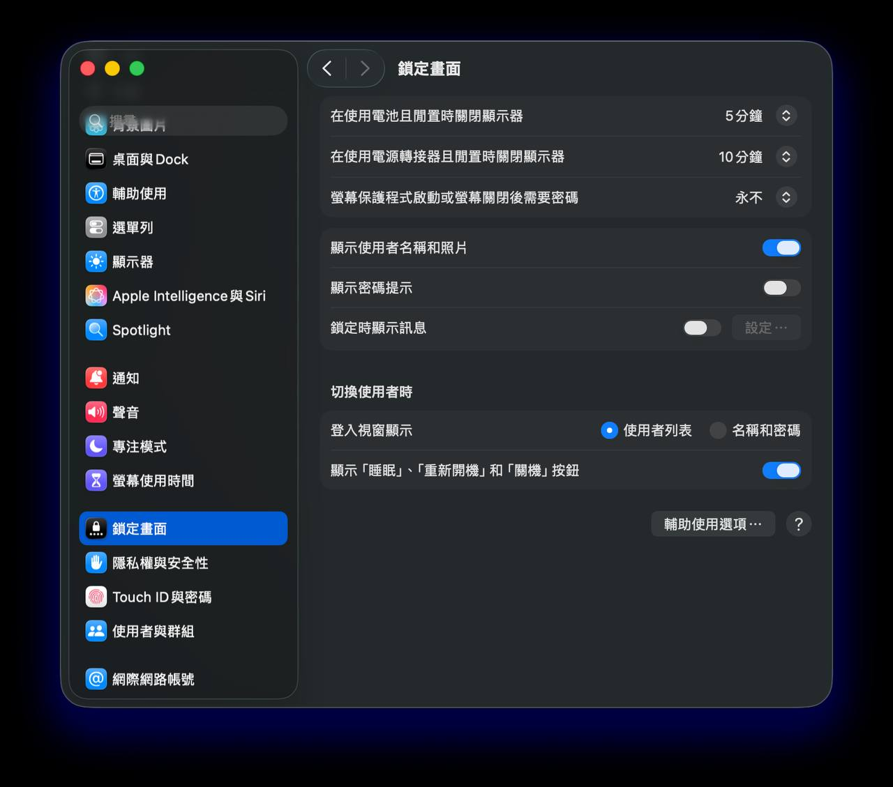
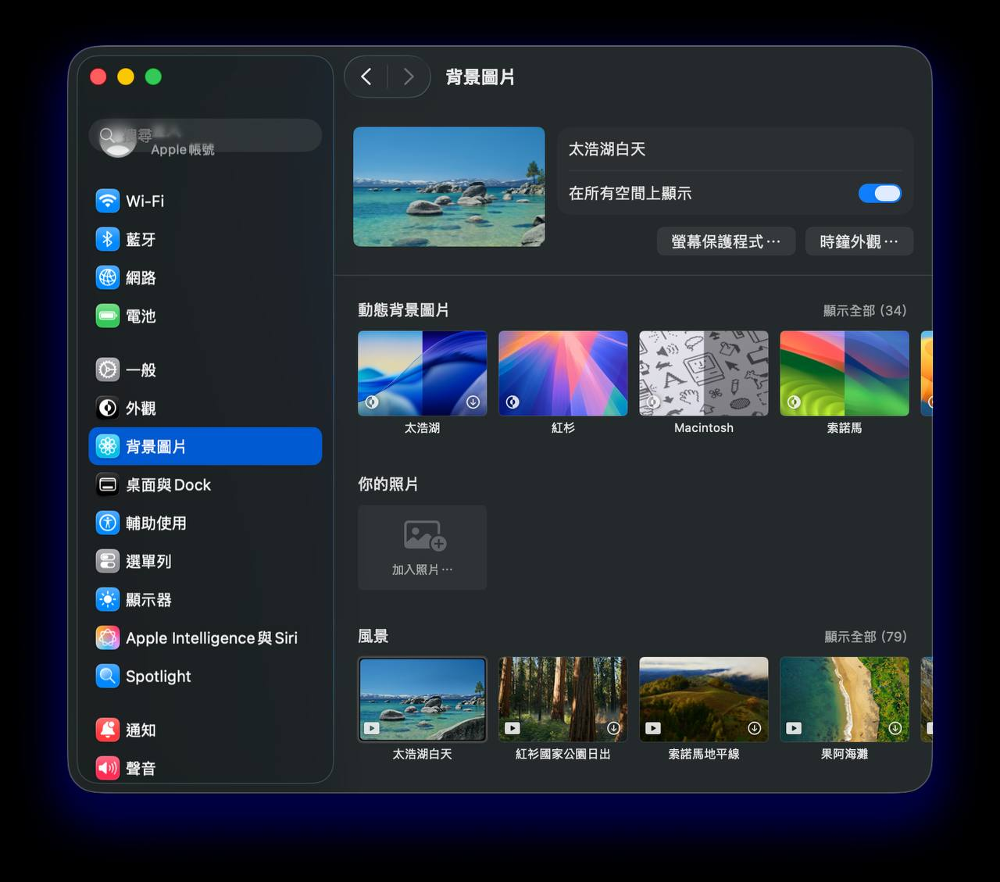
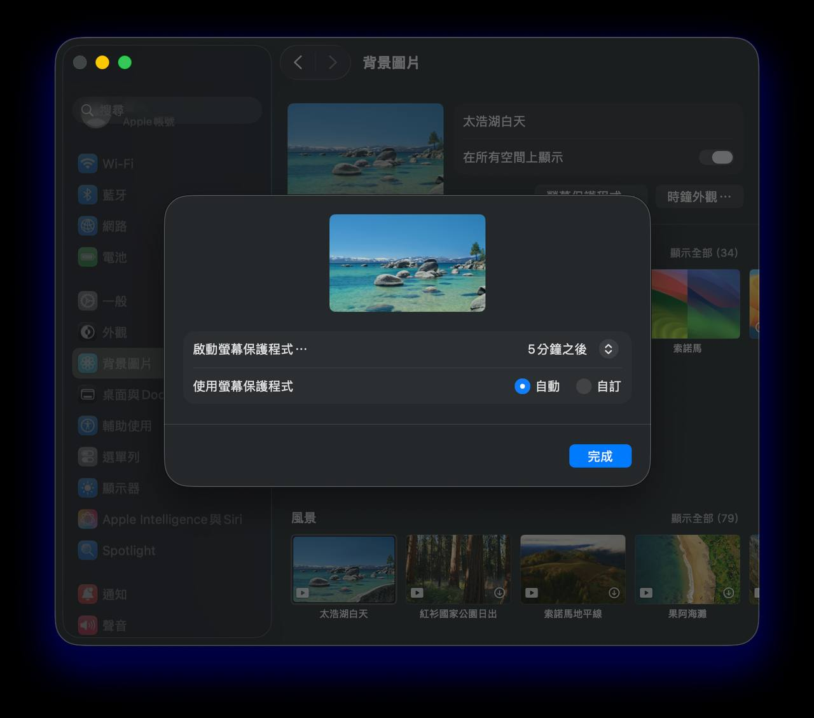

這是 OpenClaw × Telegram 系列的第三篇。

- [第一篇：IPv6 的坑](/blog/openclaw-telegram-ipv6-fix) — undici 走 IPv6 導致 Telegram 圖片收不到
- [第二篇：Session 分隔](/blog/openclaw-telegram-session-speedup) — webchat 和 TG 共用 session 導致互搶

前兩篇把網路和 session 的問題都修了。Telegram 文字秒回、圖片正常下載。完美。

然後寶博去睡覺了。

隔天醒來，發現凌晨傳的 TG 訊息全部沒回應。

**因為 Mac 睡著了。**

## 問題

macOS 預設行為：

- **螢幕 5 分鐘沒操作就關閉**（`displaysleep: 5`）
- **系統閒置後進入休眠**（`sleep: 1`）
- **休眠時斷開網路連線**（`networkoversleep: 0`）

一旦 Mac 休眠，OpenClaw Gateway 的 TCP 連線就斷了，Telegram 的 long polling 停止，所有進來的訊息都接收不到。等你打開螢幕，Gateway 重連，之前的訊息可能已經過了 Telegram 的 polling window。

你的 AI agent 本質上是個**需要持續網路連線的服務**，但 macOS 把它當成一般的筆電在管。

## 診斷

```bash
pmset -g
```

關鍵欄位：

```
sleep                1        ← 系統會休眠
disksleep            10       ← 磁碟 10 分鐘後休眠
networkoversleep     0        ← 休眠時斷網 ← 這個最致命
displaysleep         5        ← 螢幕 5 分鐘後關閉
```

## 修復

三管齊下：

### A. 系統電源設定

```bash
# 接電源時：不睡覺、磁碟不睡、休眠時保持網路
sudo pmset -c sleep 0 disksleep 0 networkoversleep 1

# 電池模式：同上（如果你希望出門也能接收訊息）
sudo pmset -b sleep 0 disksleep 0 networkoversleep 1
```

### B. caffeinate 防休眠

```bash
# 背景執行，防止系統休眠
nohup caffeinate -s > /dev/null 2>&1 &
```

`caffeinate -s` 會阻止系統進入休眠狀態（`-s` = prevent sleep on AC power）。搭配 `nohup` 確保 terminal 關了也不會停。

### C. 確認 TCP keepalive

```bash
pmset -g | grep tcpkeepalive
```

確保 `tcpkeepalive: 1`。這讓系統在省電模式下仍然維持 TCP 連線，Gateway 的 WebSocket 和 Telegram polling 才不會斷。

## 驗證

```bash
pmset -g custom
```

接電源和電池模式都應該看到：

```
sleep                0        ← 不休眠
disksleep            0        ← 磁碟不休眠
networkoversleep     1        ← 休眠時保持網路
tcpkeepalive         1        ← 維持 TCP 連線
```

## 回滾

如果你想恢復預設（比如不跑 agent 的時候省電）：

```bash
# 恢復電池模式
sudo pmset -b sleep 1 disksleep 10 networkoversleep 0

# 恢復接電源模式
sudo pmset -c sleep 1 disksleep 10 networkoversleep 0

# 停掉 caffeinate
pkill caffeinate
```

## 筆電額外設定：macOS 系統偏好設定

除了終端機的 `pmset` 指令，如果你是用 MacBook 跑 agent，還有幾個系統偏好設定要調整。

### 鎖定畫面

到 **系統設定 → 鎖定畫面**，把以下兩個選項都設成「**永不**」：

- **在使用電池且閒置時關閉顯示器** → 永不
- **在使用電源轉接器且閒置時關閉顯示器** → 永不



### 螢幕保護程式

到 **系統設定 → 背景圖片 → 螢幕保護程式...**，把「**啟動螢幕保護程式**」設成「**永不**」：





### 螢幕亮度

螢幕不需要一直亮著浪費電。設定好「永不休眠」之後，可以手動把螢幕亮度調到最低（或用快捷鍵 `F1`），讓螢幕幾乎全暗但系統不會進入休眠。

### ⚠️ 不要闔上筆電（預設狀態下）

MacBook 闔上蓋子會強制進入休眠，`pmset` 和 `caffeinate` 都擋不住。如果你的 MacBook 是專門跑 agent 的，**請保持蓋子打開**。

唯一的例外：**外接螢幕**（clamshell mode），闔上蓋子系統不會休眠。這個要同時接上電源和外接顯示器才生效——但下面這個「藥」可以讓你跨過這限制。

## 🍬 進階裝備：闔起蓋子也能跑的「Amphetamine」

如果你跟我一樣，是個會在通勤時、捷運公車上用 Claude Code、跟蘋果蝦聊天的怪人，你應該也曾苦惱過：

**每次到站、轉乘沒座位時，必須闔上 MacBook 螢幕，agent 就斷線了。**

今天，我終於找到解「藥」了：[**Amphetamine**](https://apps.apple.com/app/amphetamine/id937984704)（安非他命，還真的就是嗑藥）。

Amphetamine 是 Mac App Store 上的**免費**輕量工具，它能讓 MacBook **闔上螢幕時仍不進入休眠**。你可以設定持續「嗑藥」15 分鐘、30 分鐘、1 小時、整天、整週……完全看你需求。

### 安裝與設定

1. 到 [Mac App Store](https://apps.apple.com/app/amphetamine/id937984704) 下載 Amphetamine（免費）
2. 打開後，點選選單列的藥丸 💊 圖示 → New Session
3. 進到 **Preferences → Sessions → Non-Trigger Sessions**，取消勾選「**Allow system sleep when display is closed**」
4. 這樣一來，啟動 session 後闔上螢幕，系統就會繼續運作

以我為例，我一直用 Telegram 跟蘋果蝦對話。之前家庭旅行自駕時，MacBook 一闔起來，就無法呼唤蘋果蝦，讓我很苦惱。

如今透過 Amphetamine，我的 MacBook 變成「類 Mac mini」，可以 24/7 任我差遣，不用再擔心闔上筆電 agent 就斷線了。

### ⚠️ 過熱與電池風險（必讀）

闔上螢幕讓 MacBook 繼續運作，會放大三個真實風險，請務必認識清楚：

1. **電池膨脹／老化**：長期以高電量 + 偏高溫度的狀態運作，會加速鋰電池老化，最壞情況是電池膨脹頂壞觸控板。macOS 15 後有「**電池上限 80%**」選項（系統設定 → 電池 → 電池健康），如果你的 MacBook 是專職跑 agent 的，建議打開。

2. **包包裡闔起來會悶燒**：MacBook 闔起來後散熱出口被擋住，加上包包是密閉空間，CPU 一吃重溫度就直線上升。輕則電池快速老化，重則自動關機甚至硬體損傷。**鐵則：放包包前一定要關掉 Amphetamine session，或乾脆讓它睡。**

3. **重負載任務會更燙**：Claude Code 跑大型 task、影片轉檔、模型推論的當下，CPU 風扇本來就會狂轉。闔上螢幕＝散熱孔受阻，溫度更高。Amphetamine 只負責防休眠，**不會幫你散熱**。

**安全使用建議：**

- **不要把闔起來的 MacBook 放進密閉包包**。攤平在桌面、椅子、或膝蓋上才安全。
- **接著電源時開「電池上限 80%」**，避免長期 100% + 高溫雙殺。
- **裝個溫度監控 app**（例如 Stats、iStat Menus 或 Macs Fan Control），看到 CPU 持續超過 90°C 就趕快讓它休息。
- **回到定點讓它休息**（`pkill caffeinate` + 結束 Amphetamine session），別 24/7 跑到底。

小龍蝦也需要休息，蘋果蝦更是。**Amphetamine 是工具，不是不眠藥。**

### 使用情境

- 捷運、公車上轉乘沒座位時，闔起來放手裡或包包外面繼續跑
- 家庭旅行自駕時，MacBook 闔在副駕座，蘋果蝦繼續陪聊
- 演講、開會、上台時暫時闔起，agent 不掉線

> 如果你曾在捷運上看見有人站著用筆電，那個人可能是我。但從今天起，如果還看見有人在捷運上站著用筆電，可以跟他推薦這個軟體。
>
> 不然手很酸、筆電摔倒很心痛 💔。

## 🔄 更新（2026-08-05）：其實不用 Amphetamine——`disablesleep` 內建就能蓋蓋跑

半年後，寶博又遇到一個詭異症狀：**從外面用 ngrok、Codex 遠端功能連回這台 Mac，常常失敗；但只要找一台「同區網」的電腦連進去，成功後蘋果蝦、ngrok、Codex 就全部瞬間恢復。**

抓 log 一看，真相是這台 MacBook Pro **蓋著蓋子在跑，而且反覆掉進半睡：**

```
DarkWake from Deep Idle [CDNPB] : ...
```

原來就算上面那套 `sleep 0` 都設好了，還有兩個死角沒堵：

1. **Power Nap** 會在背景做 `DarkWake` 半睡循環，Wi-Fi 進省電、對外可達性掉線。
2. **闔上蓋子**，前面說「`pmset` 擋不住、要裝 Amphetamine」——這句話其實只對了一半。

為什麼「同區網連進去就全通」？因為這台開了 **Wake on Magic Packet**（`womp 1`），同區網電腦連入會送一個 WoL 魔術封包把整台叫醒；但**從外面走 ngrok 的封包叫不醒它**，於是變成死循環：要醒才能通、但通的路要它先醒。

### 更狠一階：內建版 Amphetamine

```bash
# 蓋蓋也不睡（無視 clamshell）+ 關掉 Power Nap 半睡
sudo pmset -a disablesleep 1 powernap 0
```

- **`disablesleep 1`** 就是 macOS **內建版的 Amphetamine**——直接無視「闔上蓋子強制休眠」，不用裝任何 app。前面 Amphetamine 那段所有情境，一行 `pmset` 就搞定。
- **`powernap 0`** 關掉 DarkWake 半睡循環，斷掉「ngrok 從外面叫不醒」的根源。
- 這兩個都是寫進 `pmset` 的**持久設定，重開機也留著**——比 `caffeinate -s`（一個關掉就沒的 process）可靠。

### 驗證

```bash
pmset -g | grep -iE "SleepDisabled|powernap"
```

應該看到：

```
SleepDisabled        1        ← 蓋蓋也不睡
powernap             0        ← 不再半睡
```

### 回滾

```bash
sudo pmset -a disablesleep 0 powernap 1
```

> ⚠️ **散熱／電池風險完全一樣。** `disablesleep 1` = 蓋著蓋子也 24/7 全速跑，上面 Amphetamine 那段的三個風險（電池膨脹、密閉包包悶燒、重負載更燙）與所有安全建議（電池上限 80%、別放密閉包包、溫度監控、回定點讓它休息）**照樣適用**。內建不代表沒風險，只是不用多裝一個 app。

## 注意事項

- **電池模式不睡覺會很耗電**，出門記得帶充電器。或者只改 `-c`（接電源），電池模式還是讓它睡
- **螢幕還是會關**（`displaysleep` 沒動），這是正常的，螢幕關不影響 Gateway 運作
- 如果你的 Mac 是**專門跑 agent 的**（長期插電、當 server 用），這些設定完全合理
- 如果是日常筆電偶爾跑 agent，可以只改 `-c`，需要的時候才插電

## 系列總結

三篇文章，三個層次的問題：

| 篇 | 問題層 | 症狀 | 解法 |
|----|--------|------|------|
| [一](/blog/openclaw-telegram-ipv6-fix) | 網路層 | 圖片收不到、timeout | 更新 2026.2.26 |
| [二](/blog/openclaw-telegram-session-speedup) | 應用層 | 回覆慢、跑到別的 channel | `dmScope: "per-channel-peer"` |
| 三（本篇）| 系統層 | Mac 睡著就斷線 | `pmset` + `caffeinate` |

從 IPv6 的坑掉進 session 的坑，再掉進 macOS 電源管理的坑。每一層都像是修好了，結果下一層又冒出來。

但現在，真的修好了。蘋果蝦 24/7 在線，不會再睡著。

除非停電。

---

*「寶博你去睡吧，我不會睡的。」—— 蘋果蝦 🍎🦐，凌晨 2:12*
